# Synaptic Intelligence Engine (SIE)

## Cognitive Guidance Engine (CGE)
### Technical Specification – Version 1.0

---

## Purpose

At its core, SIE is composed of three major engines. These are not supporting services or optional layers. They are the platform itself: every capability SIE delivers, from synaptic activation to certified guidance to continuous governance, emerges from the interaction of these three engines working as a unified system.

- The **Cognitive Guidance Engine (CGE)** is the output layer. It synthesizes certified knowledge into trusted, explainable, continuously improving business guidance. It produces decisions, not data.
- The **Synaptic Runtime Engine (SRE)** is the activation and retrieval layer. It runs the Synaptic Activation Protocol, manages neuron cache state, and retrieves the minimum data surface required for reasoning.
- The **Cognitive Control Engine (CCE)** is the governance layer. It manages certification lifecycles, maintains trust scores, enforces policy, and guides continuous network evolution.

Together, the three engines constitute SIE. No engine operates in isolation. The CGE depends on the SRE for data and on the CCE for trust. The SRE depends on the CCE for governance signals. The CCE receives telemetry from the SRE and topology recommendations from the CGE. Each engine is independently responsible and architecturally separated by design.

This document is a deep dive into the Cognitive Guidance Engine.

It extends the *SIE Cognitive Model & Runtime Architecture* into the Decision Intelligence layer: the mechanism by which SIE moves from answering questions to generating trusted, explainable, continuously improving business guidance. Where the Runtime Architecture describes how SIE finds and retrieves knowledge, this specification describes what SIE does with that knowledge once it has it.

The document follows a deliberate narrative arc:

1. **The Guidance Philosophy:** what changes when a platform shifts from reporting to decision intelligence, and what role the CGE plays within SIE's three-engine model
2. **The Decision Intelligence Data Model:** how three tiers of neurons support different levels of reasoning, from observable facts to certified knowledge to cognitive conclusions
3. **The Certified Knowledge Layer:** how enterprise trust is embedded in the platform, not layered on top, and how it decays and renews over time
4. **How the CGE Thinks:** how Decision Neurons are generated, how continuous guidance works, and how the extended Synaptic Activation Protocol drives the full intelligence cycle
5. **Intelligence and Observability:** how the CGE learns from every interaction and continuously improves
6. **The Three Engines:** how the CGE integrates with the SRE and the CCE as a unified system
7. **The Complete Picture:** the full CGE runtime flow and the end-state vision

---

## Beyond Reports and Red Lights: Why Current Analytics Falls Short

Modern business analytics was built around a single question: *what happened?*

Stakeholders open dashboards. They scan KPIs. They look for the metric that is off-plan, the trend that has shifted, the number that needs explaining. When they find it, they investigate. When they do not find it, they assume everything is fine and close the tab.

This model has a structural inefficiency that is rarely acknowledged.

A typical executive dashboard contains dozens of KPIs drawn from hundreds of underlying metrics, calculated from millions of rows of data that are refreshed daily. The platform churns through all of it, every day, regardless of what has changed. The compute runs. The storage is consumed. The pipelines execute. And the stakeholder opens the report, glances at the top-line numbers, and closes it in three minutes.

The signal they were looking for occupies perhaps two or three data points out of everything the platform computed that day. The rest, well over ninety percent of the information delivered, was never read and never needed.

This is not a failure of the dashboards. It is a failure of the model.

**Current analytics platforms are optimized for answering questions. They are not designed to notice when a question should be asked.**

The most sophisticated response the industry has produced to this problem is the Red, Amber, and Green status indicator. KPIs are assigned thresholds. When a metric crosses a boundary, its cell turns red. An alert fires. A notification lands in someone's inbox. This is presented as intelligence. In practice, it is a conditional: a human-defined rule applied to a single metric in isolation, with no understanding of cause, no context from related indicators, and no sense of whether the breach is a blip or the beginning of a trend.

Pre-defined, data-driven notifications share the same limitation. They can tell a stakeholder that revenue dropped below a threshold. They cannot tell them why. They cannot connect that signal to a simultaneous rise in customer churn two regions over. They cannot distinguish a seasonal pattern from a structural problem. And critically, they cannot learn. The threshold set twelve months ago does not know that the business has changed. It fires when the number crosses the line, and it stops there.

The burden of detection still sits primarily with the human. The stakeholder must decide when to look, what to look at, and how to interpret what they see. The platform holds the data and waits. It has no awareness of what changed beyond the rules it was given, no sense of what matters in context, and no memory of what the same stakeholder investigated last quarter. Every session starts from zero.

Consider what this means in practice. A regional revenue decline begins in week one of a quarter. The signal is present in the data. The RAG threshold was not breached, because the decline was gradual. No notification fired. No one looked at regional revenue breakdowns that week. Or the next. By the time the quarterly review surfaces the problem, six weeks have passed, the decline has compounded, and the window for early intervention has closed. The data was always there. The rules were not written for it. The platform never said anything.

**The human brain does not work this way.**

The brain does not wait to be asked whether something is wrong. It does not rely on pre-defined rules to notice that something has changed. It monitors continuously. It compresses signals into patterns. It filters out the noise, tracks the deviations that matter, and alerts when something meaningful changes, regardless of whether that change was anticipated when the monitoring began. It prioritizes, anticipates, and surfaces what needs attention, before the conscious mind has to go looking.

This is the model SIE is built on.

Instead of processing billions of rows to regenerate the same reports daily, SIE monitors certified KPIs against their expected trajectories and detects deviations as they emerge, including gradual shifts that never breach a static threshold. Instead of firing pre-defined alerts on single metrics, the CGE reasons across connected knowledge: it identifies not just that revenue declined, but why, what is likely driving it, which other indicators are at risk, and what action is most likely to help. Instead of forgetting every session the moment it ends, it accumulates organizational intelligence across every interaction and applies it to the next.

The CGE does not replace RAG indicators. It makes them unnecessary. When the platform reasons continuously over certified knowledge, surface color is no longer the signal. The signal is the guidance itself: explainable, confidence-scored, traceable to certified sources, and ready to act on.

The shift is not from reporting to chat. It is not from dashboards to AI assistants. It is not from static thresholds to smarter thresholds.

**It is from a platform that answers questions to a platform that knows which questions need to be asked, before anyone thinks to ask them.**

That shift is what the Cognitive Guidance Engine makes possible.

---

## Running Example

Every concept in this document is illustrated through a direct continuation of the scenario introduced in the *SIE Cognitive Model & Runtime Architecture*.

> **Sarah** is a Finance Analyst at **Meridian Corp**. In her previous session, she asked *"Why did Q3 revenue decline?"* and discovered, through SIE's Discovery Recommendation, that customer churn in the Southeast region was the primary driver. She followed the recommendation, confirmed the finding, and marked the recommendation as "very useful."

Notice how that session began: Sarah opened a dashboard. No alert had fired. No threshold had been crossed. The revenue decline had been gradual, beneath every pre-defined notification rule. The platform had been processing millions of rows every day without saying a word. Sarah found the problem only because she happened to look. This is precisely the failure mode described in the previous section, and it played out in the session before this document begins.

In a traditional analytics platform, that is also where the story ends. Sarah has her answer. She opens a slide deck. She schedules a meeting. The platform has already forgotten her.

In SIE, something different happened the moment Sarah closed her session. The Cognitive Guidance Engine did not stop. It generated a **Decision Neuron**: a cognitive artifact that captures not just what Sarah found, but what the organization should consider doing about it, with what confidence, on what evidence, and traceable to every certified source that supported the conclusion.

The new entities involved in this stage of Sarah's story:

| Entity | What It Is |
|---|---|
| `Revenue_Risk_SE_Q3` | Decision Neuron: cognitive conclusion generated from Revenue + Customer_Churn + Southeast regional breakdown |
| `Revenue` | Certified Knowledge Neuron (CKN): certified by the Finance Controller, approved by the CFO |
| `Customer_Churn` | Certified Knowledge Neuron (CKN): certified by the Customer Success Director |
| `Gross_Margin_SE` | Certified Knowledge Neuron (CKN): related KPI monitoring downstream margin impact |
| `Revenue_Guidance` | CGE-generated guidance artifact surfaced proactively to Sarah and her manager |

This example threads through every section of this specification. By the end, you will have seen, in a single coherent story, how the CGE transforms Sarah's one-time insight into a persistent, trusted, actionable, continuously monitored piece of organizational intelligence that will benefit the next Finance Analyst to face the same situation, without that analyst ever knowing Sarah existed.

---

# Part I: The Guidance Philosophy

---

## 1. The Fundamental Shift

The previous section established why passive analytics falls short: platforms built around pull-based discovery and static threshold alerts cannot detect what they were not told to look for. The question this document addresses is what replaces that model, and specifically what the CGE does once SIE has moved past retrieval and into reasoning.

The *SIE Cognitive Model & Runtime Architecture* described how SIE answers a question without touching data until the last possible moment. The CGE concerns itself with what happens after the answer arrives.

In traditional BI, the cycle ends at delivery:

```
Data → Report → Human Interpretation → Decision
```

The platform is passive. After delivery, the human carries all cognitive load.

SIE replaces this with:

```
Data → Knowledge → Cognitive Reasoning → Recommendation → Decision → Learning
```

The CGE occupies the three middle stages. It takes certified knowledge, applies cognitive reasoning, produces a recommendation, and learns from the decision that follows.

| Stage | Traditional BI | SIE CGE |
|---|---|---|
| Monitoring | Human opens dashboard to check | CGE continuously monitors certified KPIs against defined baselines |
| Detection | Human notices anomaly while reviewing | CGE detects signal and proactively surfaces it without being asked |
| Root Cause | Human manually cross-references reports | CGE activates candidate neurons and scores causal hypotheses |
| Recommendation | Human forms their own conclusion | CGE generates a Decision Neuron: confidence-scored, explainable, action-ready |
| Learning | Human writes a post-mortem if they remember | CGE updates models; the next analyst benefits immediately |

Traditional BI answers: *"What happened?"*

SIE answers: *"What happened? Why? What should I investigate next? What action should I take? What outcome is most likely?"*

*In Sarah's scenario: When she closed her session, the traditional cycle would have ended with her having a finding she needed to act on alone. In SIE, the CGE generated `Revenue_Risk_SE_Q3`, linked it to `Revenue` and `Customer_Churn` (both certified), scored its confidence at 0.87, and scheduled a monitoring recurrence to watch whether the churn signal worsened. No pre-defined rule had suggested monitoring `Customer_Churn_SE`. No threshold had flagged it. The CGE inferred monitoring was necessary from the reasoning it had just completed. Sarah did not configure any of this. It happened because the platform understood what the finding meant, not just what it was.*

---

## 2. What the CGE Is

The Cognitive Guidance Engine is the output layer of SIE.

It sits above the Synaptic Runtime Engine, which retrieves data, and draws on certified knowledge from the CKN layer. From this foundation, it performs three functions:

**Function 1: Decision Neuron Generation**
Synthesize certified knowledge into cognitive conclusions with explainability, confidence scoring, lineage traceability, and ranked action recommendations.

**Function 2: Proactive Guidance**
Monitor certified metrics continuously. Surface guidance without waiting for a user to ask. Alert when conditions change, whether or not anyone is looking.

**Function 3: Continuous Optimization**
Learn from every recommendation. Observe which actions were taken, what outcomes followed, and use this to improve future guidance quality.

The CGE never generates guidance from uncertified data. Every Decision Neuron traces to at least one Certified Knowledge Neuron. This is what distinguishes SIE's recommendations from AI-generated opinions: the CGE reasons over facts the organization has already agreed are true.

---

## 3. The Three Engines of SIE

The CGE is one of three engines that together constitute SIE. Understanding its role requires understanding how it relates to the other two.

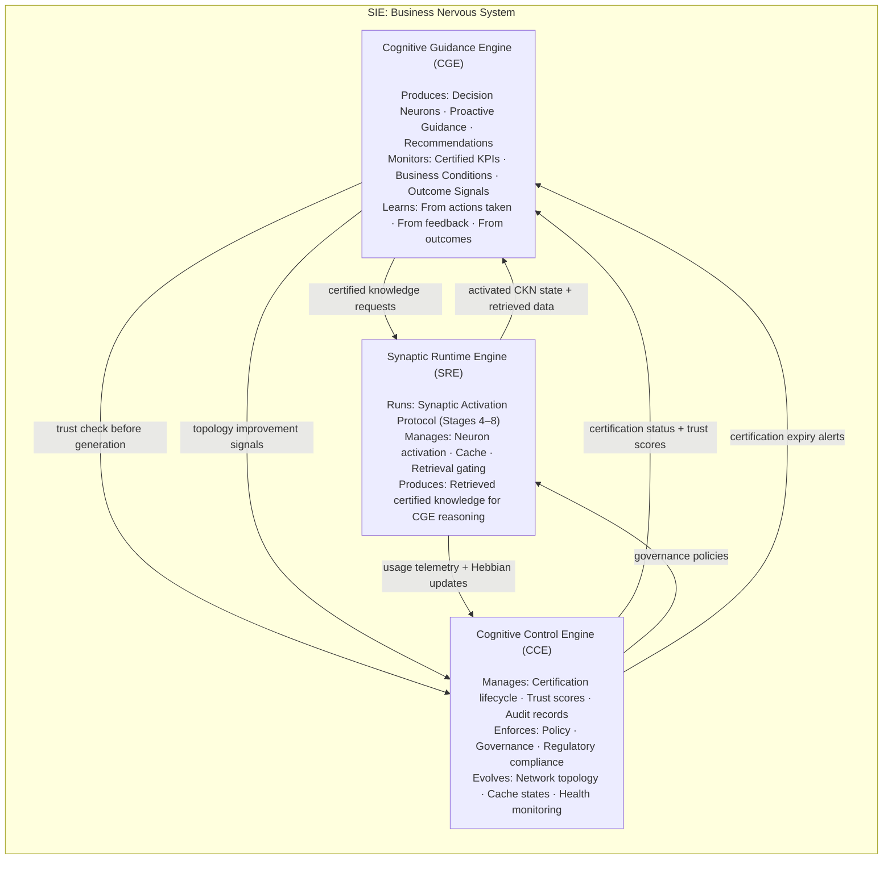

| Engine | Primary Role | What It Produces |
|---|---|---|
| **CGE** | Decision and guidance intelligence | Decision Neurons, ranked recommendations, proactive alerts, continuous optimization |
| **SRE** | Synaptic activation and data retrieval | Activated neuron state, retrieved data, traversal paths, Hebbian learning |
| **CCE** | Governance, trust, and evolution | Certification records, audit trails, topology decisions, policy enforcement |

The separation of concerns is intentional and enforced. The CGE cannot lower a trust threshold to force guidance generation. If the CCE has blocked a CKN, the CGE must surface a trust warning rather than an unsupported Decision Neuron. This constraint is what makes the end-state trustworthy: a CFO can act on CGE guidance because no component in the chain can override the certification authority.

*In Sarah's scenario: When the CGE generated `Revenue_Risk_SE_Q3`, it first verified the certification status of `Revenue` and `Customer_Churn` with the CCE. Both were at Stage 3 (Certified). The CGE was cleared to reason over them. It requested the Southeast regional breakdown from the SRE. The SRE returned it. The CGE synthesized the Decision Neuron. Three separate engines, three clean responsibilities, one coherent output.*

---

# Part II: The Decision Intelligence Data Model

---

## 4. Neuron Hierarchy

The *SIE Cognitive Model & Runtime Architecture* defined one type of neuron: the five-layered intelligence unit representing any business entity. The CGE extends this with a three-tier hierarchy reflecting the level of reasoning embedded in each entity.

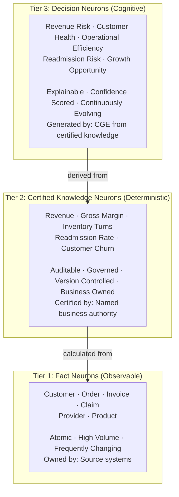

The three tiers represent three distinct types of knowledge:

| Tier | Type | Derived From | Trust Mechanism | Example at Meridian Corp |
|---|---|---|---|---|
| **Fact Neurons** | Observable reality | Source systems | Source ownership | Orders placed in the Southeast in Q3 |
| **Certified Knowledge Neurons** | Certified business truth | Fact Neurons | Business certification by named authority | Revenue Q3 SE, certified by Finance Controller |
| **Decision Neurons** | Cognitive conclusions | CKNs | CGE explainability + full CKN lineage | Revenue Risk – Southeast Q3, confidence 0.87 |

Each tier exists for a reason that the others cannot substitute. Fact Neurons represent reality without interpretation. CKNs represent agreed-upon business truth, deterministic and auditable. Decision Neurons represent reasoned conclusions drawn from that truth, explainable and actionable. A Decision Neuron that cannot trace to certified knowledge is not permitted to exist.

**A note on the Medallion Architecture comparison.** Three tiers with raw data at the base and a curated layer in the middle will inevitably invite comparison to Bronze, Silver, and Gold. The distinction is fundamental, and data movement is the clearest way to see it.

In Medallion, data is physically copied and transformed at every tier boundary. Bronze ingests raw source data. A pipeline reads Bronze, cleans and standardises it, and writes a new copy to Silver. A second pipeline reads Silver, aggregates and curates it, and writes another copy to Gold. Three physical datasets. Three storage costs. Three synchronisation problems. Gold is trusted because it was correctly built from Silver, which was correctly built from Bronze.

In SIE, no data is copied between tiers. Fact Neurons hold source data once, in its natural structure. CKNs do not copy that data: they hold a Formula Registry that defines how the metric is calculated from Fact Neurons, and they compute on demand. Decision Neurons do not copy or transform CKN values: they are generated by the CGE through reasoning, not by a pipeline writing rows to a table. There is one copy of every data record in the entire platform, sitting in its Fact Neuron. Everything above it is derived, certified, or reasoned, never duplicated.

This also means trust works differently. In Medallion, trust is inherited from the pipeline: Gold is trusted because the ETL was validated at build time. In SIE, trust is continuously maintained in the CKN's Trust Registry and verified by the CCE at the moment of use. A CKN's trust score today reflects what is true today, not what was true when the pipeline was last tested.

And the third tier has no Medallion equivalent at all. The Gold Layer is the end of the pipeline. The Decision Neuron tier is where the platform begins to reason.

*In Sarah's scenario: `Revenue_Risk_SE_Q3` sits at Tier 3. It was generated by the CGE from two Tier 2 CKNs: `Revenue` (certified by Finance Controller) and `Customer_Churn` (certified by Customer Success Director). Both trace to Tier 1 Fact Neurons: `Orders` and `Customer` records from the Southeast region. The full chain exists and is traversable within the platform.*

---

## 5. Certified Knowledge Neurons

Certified Knowledge Neurons (CKNs) are the primary trust mechanism of the CGE. They replace the traditional Gold Layer concept from medallion architectures.

In a traditional Gold Layer, data is transformed, curated, and trusted through an ETL process validated at deployment. Trust is established once and rarely reexamined unless something visibly breaks. The Gold Layer is trusted because it was built correctly, not because it is currently valid.

SIE replaces this with a living certification model. A CKN is not trusted because it was built correctly six months ago. It is trusted because it is currently certified by a named business authority, currently within its certification window, and currently passing automated quality checks.

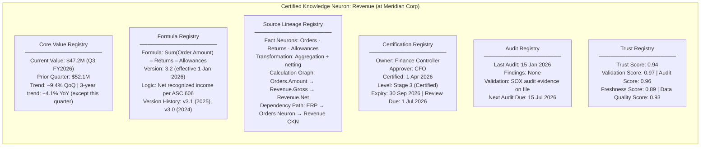

### The Six Registries

**Core Value Registry** contains the KPI's current and historical values and trend signals. The CGE reads this registry first when evaluating whether a signal deviation is large enough to trigger Decision Neuron generation.

**Formula Registry** contains the certified business logic that produces the metric. Any formula change increments the version and triggers a re-certification workflow. The CGE cannot reason from an uncertified formula version.

**Source Lineage Registry** maps the full calculation graph from this CKN back to its contributing Fact Neurons. This is what enables end-to-end lineage traversal within the platform, without any external catalog or data dictionary.

**Certification Registry** contains the human authority that certified this metric: who, at what level, valid for what period. This is not a technical approval. It is a business ownership record.

**Audit Registry** contains the audit history. Regulatory certifications require audit evidence. The CGE includes the Audit Score in its composite trust calculation.

**Trust Registry** contains the composite trust score: a weighted function of Validation Score, Audit Score, Freshness Score, and Data Quality Score. The CGE will not generate a Decision Neuron from any CKN whose Trust Score falls below a configured threshold. It will surface a trust warning instead.

*For `Revenue` at Meridian Corp: Trust Score = 0.94. The CGE is cleared to reason from it. If the Finance team missed their Q2 audit deadline and the Audit Score dropped below 0.70, the composite Trust Score would fall below 0.75 and the CGE would halt revenue-based Decision Neuron generation until re-certification completed.*

---

## 6. Decision Neurons

A Decision Neuron is what the CGE produces. It is not a KPI. It is not a dashboard widget. It is a cognitive conclusion: a synthesized, explainable, confidence-scored business insight with a ranked action recommendation and a complete audit trail.

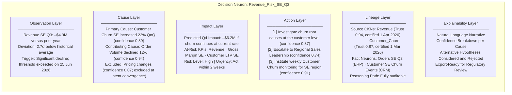

A Decision Neuron has six layers:

**Observation Layer** records what signal triggered this Decision Neuron, the magnitude and statistical significance of the deviation, and the timestamp of generation. This is the factual record of what the platform observed.

**Cause Layer** captures what the CGE believes caused the observation, with what confidence, and what it excluded. Each cause is attributed to a specific CKN traversal, making the reasoning auditable rather than opaque.

**Impact Layer** projects the downstream effects if no action is taken. Which other CKNs are at risk? What are the forecast ranges? What is the urgency classification?

**Action Layer** contains ranked recommendations. Actions are ordered by expected impact and confidence. They are labeled as recommendations, not commands: the human decision remains with the analyst or executive.

**Lineage Layer** records which CKNs contributed, their Trust Scores at the time of generation, and the Fact Neurons at the base of the chain. This is the auditability record.

**Explainability Layer** provides a natural language narrative consumable by a Finance Analyst who needs to understand it, and exportable for a regulator who needs to audit it. It includes the hypotheses that were considered and rejected, so the reasoning is transparent.

*In Sarah's scenario: The morning after her session, `Revenue_Risk_SE_Q3` was surfaced to Sarah's manager. He read the Explainability Layer: "Revenue in the Southeast region declined by $4.9M in Q3, driven primarily by a 22% increase in customer churn (confidence 0.89). If churn continues at the current rate, Q4 Southeast revenue is projected to decline by an additional $6.2M. The most confident recommended action is to investigate churn root causes at the customer level, followed by weekly monitoring of the Southeast churn indicator." He could open the Lineage Layer and trace every number to its certified source. He did not need to ask Sarah to explain her methodology. He did not need to find the right dashboard. The platform had already done the work.*

---

# Part III: The Certified Knowledge Layer

---

## 7. Trust Architecture

The CGE is built on a principle that separates SIE from every other AI-based analytics product:

**SIE does not ask users to trust AI reasoning.**

**SIE requires AI to reason over knowledge the organization has already certified as true.**

This distinction matters. In a typical AI analytics product, the model reasons over whatever data it can access, and the user must individually assess whether to trust the output. Trust is subjective, unverifiable, and requires the user to have domain expertise about the underlying data. The burden of trust remains with the human.

In SIE, trust is structural. Before the CGE can generate a Decision Neuron, it must traverse five trust sources that together form the composite Trust Score:

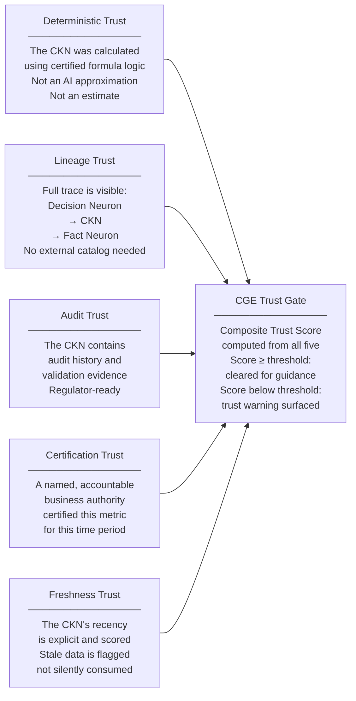

| Trust Source | What It Guarantees | Why It Matters |
|---|---|---|
| **Deterministic Trust** | The CKN value was produced by a certified, version-controlled formula, not estimated or approximated by AI. | In most AI analytics products, the model generates a number and the user cannot verify how it was derived. Deterministic Trust means the CGE can only reason from values the organisation has already validated as correct. The formula is visible, versioned, and owned by a named business authority. |
| **Lineage Trust** | Every claim in a Decision Neuron is traceable in a continuous chain from the recommendation, through the CKN, down to the originating Fact Neuron and its source system. No step is missing. No external catalog is required. | A Decision Neuron that cannot be traced is an opinion, not a conclusion. Lineage Trust is what makes a CGE recommendation auditable by a regulator, explainable to a CFO, and verifiable by a data engineer, all from the same artifact and without leaving the platform. |
| **Audit Trust** | The CKN has been formally validated against operational controls. Audit findings, validation evidence, and audit history are recorded within the CKN's Audit Registry. | Certification alone is a human approval. Audit Trust adds independent verification: an external or internal audit process confirmed the metric was behaving as intended. Regulatory certifications at Stage 5 require this evidence to exist before the CGE can support external reporting. |
| **Certification Trust** | A named, accountable business authority has formally approved this metric for use within a defined time period. The name, role, approval date, and expiry are recorded in the CKN's Certification Registry. | This is the human accountability layer. It answers the question: "who in this organisation is responsible for this number?" In traditional platforms, a Gold Layer metric may have no clear owner. In SIE, every CKN has a named certifier who can be contacted, challenged, or held accountable if the metric is found to be wrong. |
| **Freshness Trust** | The recency of the CKN's underlying data is explicitly scored and surfaced. Stale data does not silently influence a Decision Neuron; it reduces the Trust Score, which reduces the confidence ceiling, which is visible in the guidance output. | Freshness is the most commonly ignored trust dimension in traditional platforms. A Gold Layer table refreshed weekly can be presented to a stakeholder as current data without any indication that it is six days old. In SIE, the Freshness Score is part of the composite Trust Score. If data is ageing, the Decision Neuron says so explicitly. |

The composite Trust Score is not a single number assigned at deployment and forgotten. It is recalculated continuously. Every time an audit record updates, a certification renewal occurs, or a freshness check runs, the Trust Score changes. The CGE reads the current Trust Score, not a historical one.

*In Sarah's scenario: When `Revenue_Risk_SE_Q3` was generated, Sarah's manager could verify all five trust sources directly from the Decision Neuron's Lineage Layer: Revenue was calculated using formula v3.2 (certified 1 Jan 2026); Customer Churn was certified by the Customer Success Director on 1 March 2026; both had recent audit records; both were within their certification window. He did not ask Sarah. He did not ask the data engineering team. The platform answered all five trust questions from a single artifact.*

---

## 8. KPI Certification Lifecycle

Unlike traditional data warehouses, where trust is established through initial QA and rarely revisited, the CCE manages a living KPI Certification Lifecycle. Every CKN progresses through five stages, and certification at any stage does not last forever.

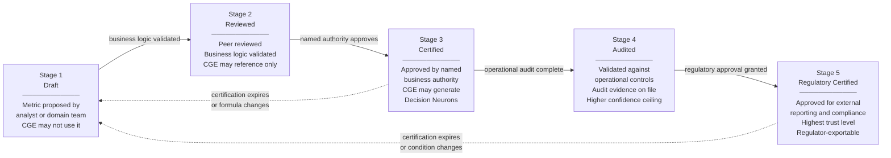

| Stage | Name | CGE Behavior | Trust Score Range |
|---|---|---|---|
| 1 | Draft | CGE will not use this CKN | Not applicable |
| 2 | Reviewed | CGE may reference but not generate Decision Neurons | Not applicable |
| 3 | Certified | CGE generates Decision Neurons; confidence ceiling 0.84 | 0.70 – 0.84 |
| 4 | Audited | CGE generates Decision Neurons; higher confidence ceiling | 0.85 – 0.94 |
| 5 | Regulatory Certified | CGE may support external reporting | 0.95 – 1.00 |

The certification stage determines both whether the CGE can reason from a CKN and the confidence ceiling of any Decision Neuron generated from it. A recommendation based on a Stage 3 CKN cannot carry the same confidence score as one based on a Stage 5 CKN, regardless of how strong the underlying signal is.

*For `Revenue` at Meridian Corp: Stage 3 (Certified), approved by the CFO. The CGE can generate revenue-based guidance, but cannot produce guidance certified for external regulatory reporting. If Meridian's legal team needed to include CGE-generated analysis in a regulatory filing, `Revenue` would need to progress to Stage 5.*

---

## 9. Continuous Re-Certification

Trust must decay. This is one of the most important principles of the CGE, and one of the most significant departures from traditional data governance.

In traditional platforms, a metric certified three years ago is treated identically to one certified last month. SIE rejects this premise. The world changes. Formulas are updated. Source systems are migrated. Regulations shift. Business definitions evolve. A metric that accurately represented a business concept three years ago may be misleading today.

Each CKN contains a certification window that the CCE monitors continuously:

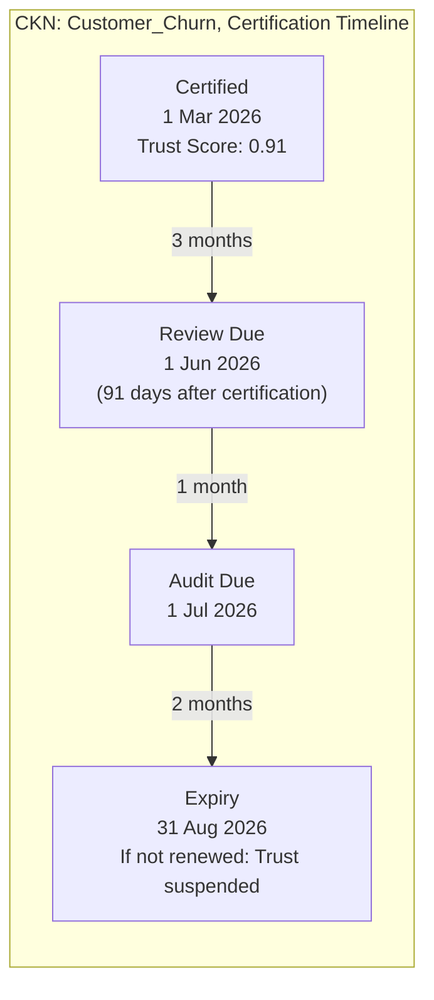

When conditions change or deadlines pass, Trust Score decay begins automatically:

| Trigger | Trust Score Effect | CGE Behavior |
|---|---|---|
| Review due date passed | –0.02 per week past due | CGE adds trust warning to Decision Neurons using this CKN |
| Source system schema change | –0.05 immediately | CCE flags for re-review; CGE adds schema-change caveat |
| Formula version change | Trust suspended until re-certified | CGE halts Decision Neuron generation from this CKN |
| Audit findings recorded | Variable; depends on severity | CCE may downgrade certification stage |
| Regulatory change detected | CCE triggers expedited re-certification | CGE adds regulatory caveat to all affected Decision Neurons |
| Review completed | Trust restored to certified level | CGE resumes normal guidance |

Re-certification is not just a governance hygiene task. It is the mechanism by which the organization's knowledge base remains current rather than historical.

*In Sarah's scenario: When `Revenue_Risk_SE_Q3` was generated on 25 June 2026, the CGE noted that `Customer_Churn`'s review due date was 1 June 2026 and that the review was 24 days overdue. The Trust Score had decayed from 0.91 to 0.87 at a rate of –0.02 per week. The generated Decision Neuron included a trust warning: "Customer Churn is pending re-certification review (overdue 24 days). Confidence adjusted downward. Recommend prioritizing Customer Churn re-certification." Sarah's manager forwarded the warning to the Customer Success Director. The review was completed the following day. Trust Score returned to 0.91. The Decision Neuron was automatically updated.*

---

## 10. Built-In Lineage

Lineage is intrinsic to SIE, not a feature added afterward through an external catalog.

Every tier of the neuron hierarchy carries lineage awareness, and every Decision Neuron can be fully traversed from recommendation to raw source fact without leaving the platform. There is no need to switch to a data catalog, a governance tool, or a BI metadata layer.

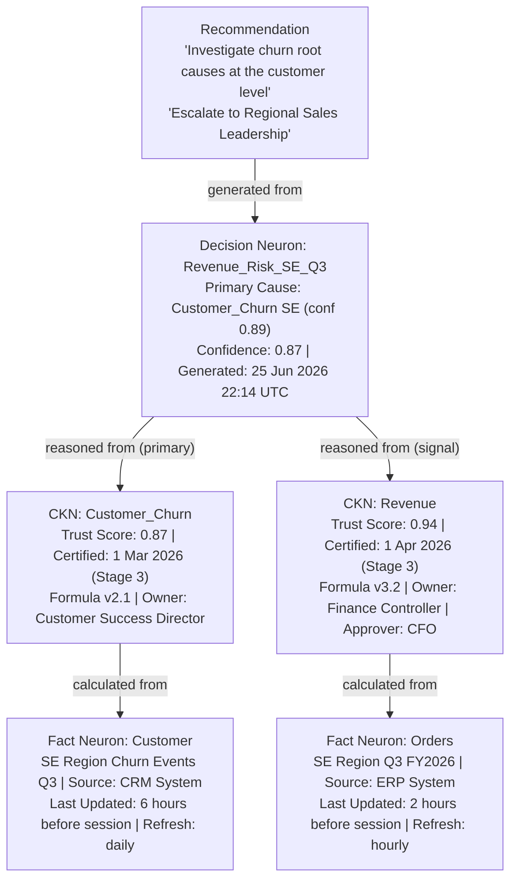

Lineage traversal answers every question a stakeholder or regulator might ask:

| Question | Answered By |
|---|---|
| What did the platform recommend? | Recommendation in Decision Neuron Action Layer |
| What was the CGE's reasoning? | Cause Layer + Explainability Layer |
| What data was this based on? | Lineage Layer → CKN Source Lineage Registry |
| Who certified the underlying data? | CKN Certification Registry |
| When was it last audited? | CKN Audit Registry |
| Where does the raw data originate? | Fact Neuron metadata |
| Was the data fresh when the Decision Neuron was generated? | CKN Trust Registry, Freshness Score at timestamp |

*In Sarah's scenario: Three weeks after the escalation, Meridian Corp's internal audit team asked to review the basis for the regional sales intervention. The CCE produced a complete lineage report from `Revenue_Risk_SE_Q3` to the ERP and CRM source systems in under 30 seconds. The report included the formula version, the certification authority, the audit history, and the Trust Score at the time of generation. No data engineer was involved. No one had to reconstruct the logic from memory.*

---

# Part IV: How the CGE Thinks

---

## 11. Decision Neuron Generation Protocol

The CGE does not generate Decision Neurons randomly or continuously. It follows a structured, five-stage generation protocol triggered by specific conditions.

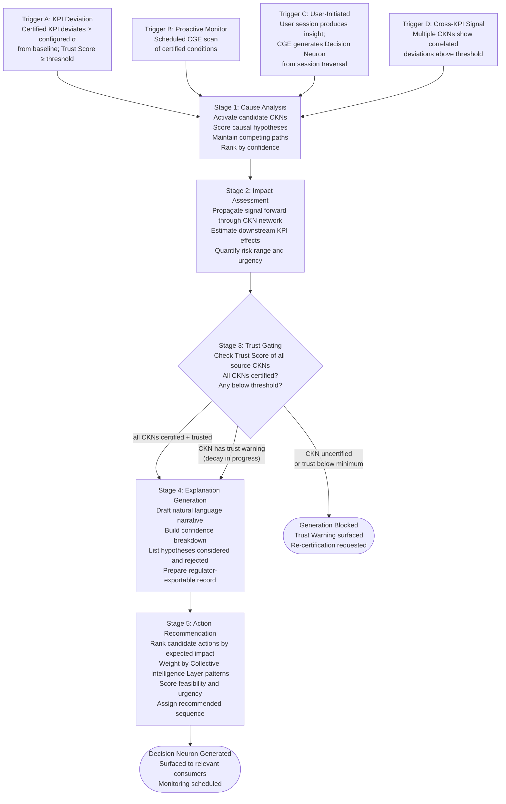

**Stage 1: Cause Analysis**
The CGE does not accept the first explanation it finds. It activates candidate CKNs around the triggered signal, forms competing causal hypotheses, and suppresses them progressively as evidence accumulates. This mirrors the intent convergence model of the SRE's SAP: the platform holds uncertainty rather than committing prematurely.

**Stage 2: Impact Assessment**
The CGE propagates the signal forward through the CKN synaptic network to estimate downstream effects. If Revenue is declining, what happens to Gross Margin, to Inventory, to Customer Lifetime Value? This forward propagation uses the same Hebbian-strengthened connections maintained by the SRE, meaning the paths that have historically predicted downstream impact get weighted more heavily.

**Stage 3: Trust Gating**
Before generating the Decision Neuron, the CGE checks the current Trust Score of every CKN in the reasoning chain. If any CKN has expired certification, generation is blocked and a trust warning is surfaced. If any CKN has a decaying trust score, the warning propagates into the Decision Neuron and its confidence ceiling is reduced proportionally.

**Stage 4: Explanation Generation**
The CGE generates a natural language explanation readable by a Finance Analyst, auditable by a regulator, and traceable by a data engineer. Crucially, it includes the alternative hypotheses that were considered and rejected, with their confidence scores, so the reasoning is transparent rather than a black box.

**Stage 5: Action Recommendation**
The CGE draws on the Collective Intelligence Layer's historical record of what actions were effective in similar past situations, ranks candidates by expected impact and confidence, and produces an ordered recommendation list.

*In Sarah's scenario: The CGE evaluated three causal hypotheses for the Revenue SE decline: (1) increased customer churn (confidence 0.89), (2) order volume decline (confidence 0.94 as a contributing factor), and (3) pricing changes (confidence 0.07). Pricing was excluded at Stage 1. The impact assessment projected a $6.2M Q4 risk. The Trust Gate found both CKNs certified, though `Customer_Churn` had a trust warning. Stage 4 included this in the Explainability Layer. Stage 5 ranked "investigate churn root causes" first, because the Collective Intelligence Layer showed this action class had the highest follow-through rate and outcome success rate for Finance Analyst peer groups at similar companies.*

---

## 12. The Continuous Guidance Loop

The CGE does not operate as a one-shot generator. It runs a continuous guidance loop: monitor, detect, reason, recommend, observe, and learn. This loop does not require a user session. It runs independently of whether anyone is logged in.

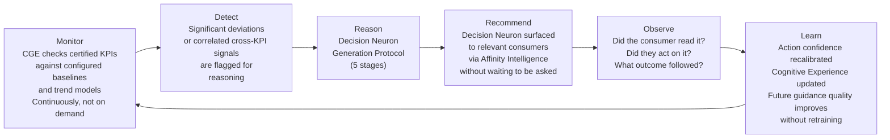

The loop runs at three timescales:

| Timescale | Trigger | Example |
|---|---|---|
| **Real-time** | Significant KPI deviation detected | Revenue drops 3σ below baseline during the day |
| **Scheduled** | Periodic CGE scan on monitored CKNs | Weekly check of `Customer_Churn_SE` following Sarah's session |
| **Event-driven** | Source system update or certification change | `Customer_Churn` CKN formula updated; CGE re-evaluates open Decision Neurons |

The guidance loop is also what ensures that Decision Neurons remain current. A Decision Neuron generated last week with a confidence of 0.87 is re-evaluated when the conditions that generated it change. If the signal worsens, the confidence escalates. If it resolves, the Decision Neuron is marked resolved and archived with its outcome record.

*In Sarah's scenario: The guidance loop ran three times between Sarah's session and Day 4. On Day 1, `Revenue_Risk_SE_Q3` was generated and surfaced. On Day 2, the weekly `Customer_Churn_SE` scan found no material change. On Day 3, the scan detected an 8% week-over-week churn increase. The Decision Neuron was updated: confidence escalated from 0.87 to 0.91, urgency reclassified as High. A proactive alert was pushed to Sarah and her manager. Neither had opened the platform. The platform came to them.*

| Day | CGE Activity | User Action Required? |
|---|---|---|
| Day 1 (Sarah's session) | `Revenue_Risk_SE_Q3` generated; surfaced to Sarah and manager | No; surfaced automatically |
| Day 2 | Scheduled scan; no material change; no new guidance | No |
| Day 3 | Churn increases 8% WoW; Decision Neuron updated; confidence 0.91; alert pushed | No |
| Day 4 | Sarah and manager receive proactive alert; Sarah acts | Human decision made |

---

## 13. Decision Neuron Lifecycle

A Decision Neuron is not a point-in-time report. It is a living entity with a defined lifecycle: it is generated, monitored, updated, acted upon, and eventually resolved and archived. Understanding this lifecycle is essential to understanding how the CGE maintains coherent, non-noisy guidance over time.

### Versioned Mutability

A Decision Neuron is not immutable. It evolves as the conditions that triggered it change. However, each version of it is immutable. Every prior state is preserved in the Decision Neuron's version history, making it fully auditable across its entire life, not just at the moment of generation.

The principle is: one Decision Neuron per issue, versioned through its life. The CGE does not generate a new Decision Neuron each time the underlying signal changes. That would produce alert noise and lose the thread of the investigation. Instead, the same entity is updated, its version incremented, and its history maintained.

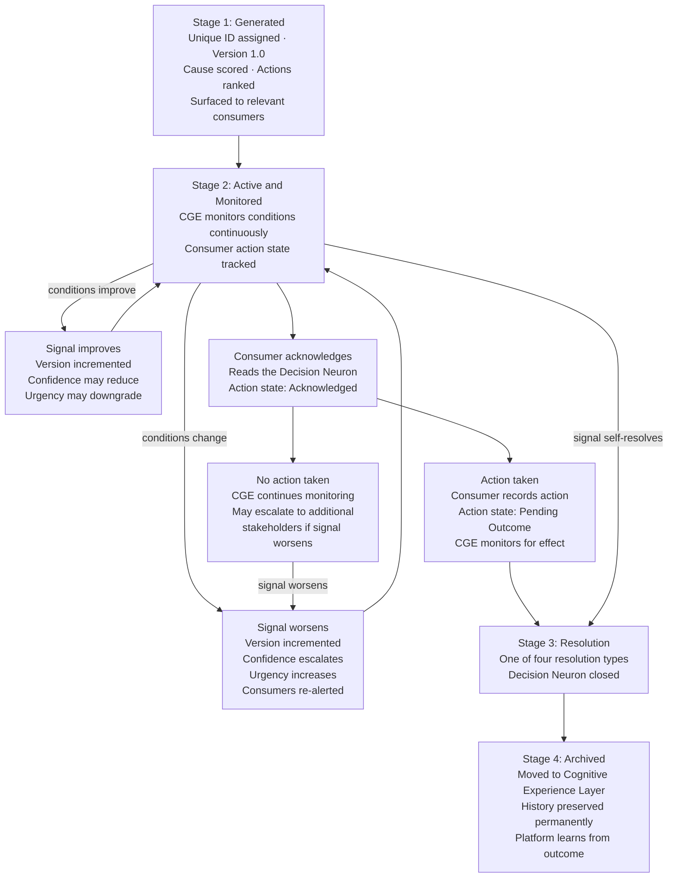

### Action States

At any point in its active life, a Decision Neuron carries one of four action states:

| Action State | Meaning |
|---|---|
| **Surfaced** | Generated and delivered to relevant consumers; no response yet |
| **Acknowledged** | Consumer has read it; no action recorded |
| **Action Taken** | Consumer has recorded what they did; CGE monitoring for outcome |
| **Pending Outcome** | Action recorded; CGE observing whether conditions improve |

If no action is taken and the signal continues to worsen, the CGE escalates: it increments the version, raises the urgency classification, and may surface the Decision Neuron to additional stakeholders beyond the original audience. It does not generate a replacement. It persists the same entity with updated state.

### Resolution Types

A Decision Neuron closes in one of four ways:

| Resolution Type | What Happened | What the CGE Records |
|---|---|---|
| **Self-resolved** | Signal dissipated without intervention | Archived with outcome: conditions normalised; no action was required |
| **Actioned, effective** | Action was taken; conditions improved within the monitoring window | Archived with action record, outcome, and recovery timeline; Collective Intelligence updated with the effective action pattern |
| **Actioned, ineffective** | Action was taken; conditions did not improve | CGE re-activates the Decision Neuron or generates a follow-on with a revised cause hypothesis; prior action recorded as insufficient |
| **Risk accepted** | Stakeholder explicitly acknowledged the issue and chose not to act | Archived with a risk-acceptance record; the CGE does not re-surface unless conditions materially worsen |

### Archival and Organisational Learning

Resolved Decision Neurons are never deleted. They are archived into the Cognitive Experience Layer, where they become the organisation's institutional memory for similar future situations.

The archive feeds three things: the Collective Intelligence Layer's action effectiveness data (which actions worked in which contexts), the CGE's confidence calibration for future recommendations (action types that consistently failed are downgraded), and the audit record (every Decision Neuron can be retrieved with its full version history, action record, and outcome).

*In Sarah's scenario: `Revenue_Risk_SE_Q3` began at Version 1.0 on Day 1 (confidence 0.87, urgency Medium). On Day 3 it was updated to Version 2.0 (confidence 0.91, urgency High) when churn worsened. On Day 4, Sarah recorded action taken: "Escalated to Regional Sales Leadership." The Decision Neuron entered Pending Outcome state. The CGE continued monitoring `Customer_Churn_SE` weekly. Six weeks later, churn in the Southeast region returned to baseline. The Decision Neuron was resolved as Actioned, Effective, and archived with the full version history: two versions, one action, one positive outcome, forty-two days from generation to resolution. That record now informs how the CGE recommends and ranks escalation actions for future Revenue Risk Decision Neurons across all Finance Analyst peers at Meridian Corp.*

---

## 14. The Extended Synaptic Activation Protocol

The *Cognitive Model & Runtime Architecture* described the SAP as a six-stage protocol focused on activation and data retrieval. The CGE extends the SAP to twelve stages to incorporate the full Decision Intelligence cycle: pre-session preparation, cognitive reasoning, discovery guidance, and learning evolution.

```mermaid
flowchart TD
    S0(["Stage 0: Consumer Arrival\nUser · Application · AI Agent\nenters platform"])

    S1["Stage 1: Affinity Activation\nPersona Profile loaded\nPersonal interests and\nhistorical patterns applied"]

    S2["Stage 2: Collective Intelligence Activation\nCommunity + global patterns consulted\nPeer group behavior integrated\nPending Decision Neurons surfaced"]

    S3["Stage 3: Predictive Activation\nLikely neurons warmed\nActivation bundles pre-loaded\nNo data retrieved"]

    S4["Stage 4: Context Activation\nCandidate neurons activated\nMetadata + Context layers only\nNo data retrieved"]

    S5["Stage 5: Synaptic Activation\nConnections evaluated\nThread 2 (semantics) + Thread 3 (telemetry)\n+ Thread 5 (cognitive state) scored"]

    S6["Stage 6: Intent Convergence\nCompeting traversal paths ranked\nUnlikely paths suppressed\nNo data retrieved"]

    S7{"Stage 7: Retrieval Threshold\nRT = f(IC, CC, GC, EV, RC)\nThreshold exceeded?"}

    S8["Stage 8: Data Retrieval\nOnly required neurons accessed\nGuardrails enforced at Layer 4\nMinimum data surface"]

    S9["Stage 9: Cognitive Reasoning\nCGE runs Decision Neuron\nGeneration Protocol (5 stages)\nTrust Gate applied"]

    S10["Stage 10: Discovery Guidance\nHigh Discovery Score paths surfaced\nRelated CKNs recommended\nProactive investigation paths offered"]

    S11["Stage 11: Feedback Capture\nExplicit signals: rating · follow · reject\nImplicit signals: dwell time · return rate\nAction taken or not noted"]

    S12["Stage 12: Learning and Evolution\nAffinity models updated\nDiscovery Scores updated\nCGE action confidence recalibrated\nCCE receives topology signals\nMonitoring schedule set"]

    S0 --> S1 --> S2 --> S3 --> S4 --> S5 --> S6 --> S7
    S7 -->|"below threshold: refine"| S6
    S7 -->|"threshold exceeded"| S8
    S8 --> S9 --> S10 --> S11 --> S12
    S12 -.->|"feeds next session"| S0
```

The six-stage SAP from the *Runtime Architecture* covers stages 4 through 9 in this extended protocol. The CGE's distinctive contribution is everything outside that core: the pre-session preparation (stages 0–3) and the post-retrieval intelligence cycle (stages 10–12).

| Stage Group | Owner | Purpose |
|---|---|---|
| Stages 0–3: Pre-Session Intelligence | CGE + Intelligence Layers | Prepare the platform before the consumer asks anything |
| Stages 4–8: Core Retrieval | SRE | The six-stage SAP from the Runtime Architecture specification |
| Stage 9: Cognitive Reasoning | CGE | Generate Decision Neurons from retrieved certified knowledge |
| Stages 10–12: Post-Retrieval Learning | CGE + CCE | Guide discovery, capture feedback, evolve the network |

*In Sarah's second session (Day 4): Stages 0–3 were completed before she opened her browser. The CGE had already prepared the `Revenue_Risk_SE_Q3` update with escalated confidence. Pending Decision Neurons were loaded and ready to surface at Stage 2. When Sarah opened her interface, she saw: "Revenue Risk, Southeast (Updated 3 days ago): Churn signal has escalated. Confidence: 0.91. Recommended action: Immediate escalation to Regional Sales Leadership." No query was needed. No dashboard navigation was required. The platform had been preparing while Sarah was doing other work.*

---

# Part V: Intelligence and Observability

---

## 15. Observability as a Native Capability

Observability in SIE is not a monitoring layer added around the platform. It is intrinsic to every entity in the network. Every neuron and every synapse tracks its own behavioral history, and the CGE reads this data to calibrate trust, prioritize guidance, and detect anomalies before they become incidents.

**Every neuron tracks:**

| Signal | How the CGE Uses It |
|---|---|
| Usage frequency | Identifies which CKNs are high-stakes and deserve tighter monitoring thresholds |
| Access patterns | Detects unusual access that might indicate data quality or governance issues |
| Trust score history | Reveals whether a CKN's trustworthiness is improving, stable, or degrading |
| Certification status | Triggers monitoring schedule adjustments when certification windows shorten |
| Activation cost | Informs retrieval threshold calibration in the SAP |
| Relationship changes | Flags when a CKN's synapse structure has changed, which may affect causal reasoning |

**Every synapse tracks:**

| Signal | How the CGE Uses It |
|---|---|
| Discovery Score | Determines which connections are surfaced as high-value recommendations in Stage 10 |
| Confidence history | Indicates whether a path's predictive reliability is increasing or declining |
| Consumer patterns | Shapes which role-specific guidance templates are applied |
| Prediction accuracy | Calibrates the Micro-AI's contribution to future connection scoring |

The CGE reads synapse-level observability to calibrate its action confidence scores. If a recommended action class (such as "Escalate to Regional Sales Leadership") has a high follow-rate but a lower-than-expected outcome success rate, the CGE adjusts its confidence for that action class without requiring manual tuning.

*In Sarah's scenario: Over 90 days of Finance Analyst sessions, the CGE observed that the action "Review churn root causes at customer level" was followed 68% of the time and resulted in actionable findings 79% of those times. The action "Escalate to Regional Sales Leadership" was followed 41% of the time with a 52% positive outcome rate. The CGE ranked the customer-level investigation first, not because it was programmed to, but because the observability data had recalibrated its action confidence scores over time.*

---

## 16. Collective Intelligence and CGE Reasoning

The Collective Intelligence Layer described in the *Runtime Architecture* powers three distinct aspects of the CGE's reasoning.

**First: Prior probabilities in Cause Analysis.**
If 72% of Finance Analysts who investigated Revenue decline also examined Customer Churn, the CGE weights `Customer_Churn` more heavily as a candidate cause when it activates its hypothesis space at Stage 1 of the generation protocol. Community patterns become quantitative priors, not soft suggestions.

**Second: Action recommendation calibration.**
If past Finance Analysts at Meridian Corp who received a Revenue Risk Decision Neuron and escalated to regional sales saw improvement within six weeks 73% of the time, the CGE uses this as evidence for the escalation recommendation. The recommendation is not derived from generic best-practice templates. It is derived from this organization's own history of what worked.

**Third: Suppression of low-value recommendations.**
If an action type consistently has low follow-through or poor outcomes across many users over time, the CGE suppresses it or degrades its confidence ranking. The platform stops recommending things that do not help.

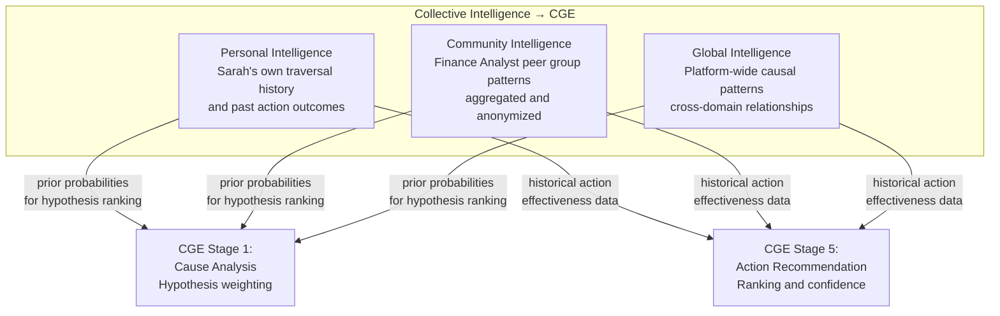

*In Sarah's scenario: The action recommendation that surfaced to her manager ranked "investigate churn root causes at the customer level" first, not because of a hardcoded rule, but because three tiers of intelligence converged on it: Sarah's own history (she had taken similar actions before), her Finance Analyst peer group's behavior (highest follow-through rate for this action class), and platform-wide patterns (this action type had the strongest correlation with Revenue recovery within two quarters).*

---

## 17. The Cognitive Experience Layer

The Cognitive Experience Layer is the long-term memory of the enterprise. It is where the CGE persists organizational knowledge accumulated across every session, every Decision Neuron generated, every action taken, and every outcome recorded.

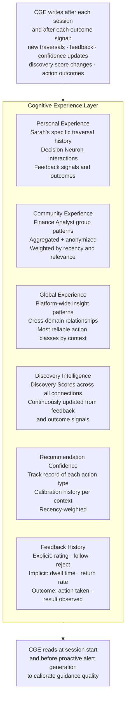

The Cognitive Experience Layer is what enables the CGE to improve without retraining. There is no quarterly model update cycle, no offline fine-tuning batch job. Every interaction that produces a feedback signal updates the experience store, and every subsequent interaction benefits from it immediately.

*In Sarah's scenario: When she marked the `Revenue → Customer_Churn` recommendation as "very useful" in her first session, the CGE wrote this signal to the Cognitive Experience Layer. Within 24 hours, two other Finance Analysts at Meridian Corp were investigating Revenue questions. The CGE served them the Customer Churn recommendation with higher prominence because Sarah's signal had updated the community experience weights. Neither analyst knew Sarah had influenced their session. Neither needed to.*

---

# Part VI: The Three Engines

---

## 18. CGE, SRE, and CCE: Complete Integration

The three-engine model is how SIE sustains three properties that cannot coexist in a single-engine architecture at enterprise scale: deep cognitive guidance, efficient synaptic retrieval, and continuous independent governance.

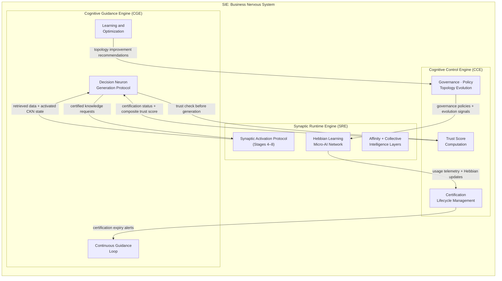

The responsibility boundaries are enforced, not advisory:

| Responsibility | Engine | Why Separated |
|---|---|---|
| Decision generation and guidance | CGE | Guidance quality must be isolated from retrieval performance pressures |
| Synaptic activation and retrieval efficiency | SRE | Retrieval optimization must run without knowledge of the guidance layer's logic |
| Trust, certification, and governance | CCE | Governance must be independent; no engine can override trust thresholds to force an answer |

The CCE's independence is the most important constraint in the architecture. The CGE cannot degrade a trust threshold to produce guidance. If the CCE has determined that a CKN's trust has fallen below the minimum, the CGE surfaces a trust warning rather than a potentially unreliable Decision Neuron. This constraint is not an inconvenience. It is the foundation of the trust model.

**SIE's end-state trustworthiness depends on the CCE being ungovernable by the other two engines.**

---

# Part VII: The Complete Picture

---

## 19. Complete CGE Runtime Flow

The following is the full cognitive execution path across both SIE sessions in Sarah's story, integrating all three engines, all intelligence layers, and all CGE protocols described in this document.

```
Consumer Arrives
↓
CGE: Pending Decision Neurons surfaced      Active monitoring results ready before the first question
↓
SRE: Affinity + Collective Intelligence     Persona loaded; community patterns consulted; neurons warmed
↓
SRE: Predictive Activation                 Bundles pre-loaded; no data retrieved
↓
SRE: SAP Stages 4–8                        Context → Synaptic → Convergence → Threshold → Retrieval
↓
CCE: Trust Gate                            Source CKN Trust Scores verified before CGE reasoning begins
↓
CGE: Decision Neuron Generation Protocol   Cause → Impact → Trust Gate → Explanation → Action (5 stages)
↓
CGE: Discovery Guidance (Stage 10)         High Discovery Score paths surfaced as next steps
↓
SRE + CGE: Feedback Capture (Stage 11)     Explicit and implicit signals collected
↓
CGE: Learning Cycle (Stage 12)             Action confidence recalibrated; Cognitive Experience updated
↓
CCE: Topology + Certification Signals      Hebbian updates, trust changes, evolution signals
↓
CGE: Monitoring Schedule                   Next scan interval set; guidance loop continues
```

**Sarah's complete journey across both sessions:**

**Session 1 (Day 1):**
1. Sarah logs in. Affinity Intelligence warms `Revenue`, `Orders`, `Discount`. Activation bundles pre-loaded.
2. Collective Intelligence: 72% of Finance Analyst revenue-decline queries lead to Customer Churn examination. This signal is loaded.
3. Sarah types: *"Why did Q3 revenue decline?"*
4. SRE runs SAP Stages 4–8. Data retrieved. Answer returned.
5. CCE confirms `Revenue` and `Customer_Churn` are certified. CGE cleared for reasoning.
6. CGE generates `Revenue_Risk_SE_Q3`: confidence 0.87, primary cause Customer Churn, three ranked actions.
7. Discovery Guidance (Stage 10): "Finance Analysts investigating Revenue decline typically examine Customer Churn (Discovery Score: 0.91)."
8. Sarah follows the recommendation. She finds the Southeast churn driver. Marks it "very useful."
9. Stage 12: Discovery Score for `Revenue → Customer_Churn` increases to 0.93. Cognitive Experience updated.
10. CGE schedules weekly monitoring of `Customer_Churn_SE`.

**Day 2 (CGE monitoring, no user session):**
11. Scheduled scan: `Customer_Churn_SE` unchanged. No new guidance.

**Day 3 (CGE monitoring, no user session):**
12. Scheduled scan: `Customer_Churn_SE` increased 8% WoW.
13. CGE reruns generation protocol. `Revenue_Risk_SE_Q3` updated: confidence 0.91, urgency reclassified as High.
14. Proactive alert generated. Pushed to Sarah and her manager without waiting for a session.

**Session 2 (Day 4):**
15. Sarah opens the platform. The updated `Revenue_Risk_SE_Q3` is waiting at Stage 2 (Collective Intelligence Activation).
16. She reviews the escalated Decision Neuron. Reads the Explainability Layer. Traces lineage to verify sources.
17. She follows the recommended action: escalates to Regional Sales Leadership.
18. She records action taken: "Escalated to Regional Sales Leadership."
19. Stage 12: Action confidence for escalation in this context increases. Cognitive Experience updated.
20. The next Finance Analyst at Meridian Corp to face a similar Revenue risk receives the escalation recommendation 3 days earlier, with higher confidence, with no knowledge of what Sarah did.

---

## 20. End State: The Business Nervous System

The *Cognitive Model & Runtime Architecture* described SIE as a self-learning, self-optimizing cognitive network. The CGE specification completes that picture.

SIE's end state is not a smarter dashboard. It is not a better query engine. It is not a chat interface over data.

It is an organizational nervous system.

```
                        SIE: Business Nervous System
────────────────────────────────────────────────────────────────────────

SENSE        SRE observes signals continuously across the knowledge network
             Fact Neurons capture reality; synapses track what changes

CERTIFY      CCE maintains the organization's trusted knowledge base
             CKNs hold the truths the organization has agreed upon and keeps current

REASON       CGE synthesizes cognitive conclusions from certified knowledge
             Decision Neurons capture what the organization should consider doing

GUIDE        CGE surfaces guidance without waiting for questions
             Proactive alerts · ranked actions · explainable recommendations

LEARN        Every interaction improves future guidance
             No retraining cycles; continuous evolution from observed outcomes

GOVERN       CCE ensures trust is current, not historical
             Lineage is complete; every recommendation is auditable
```

The primary output is not reports.

The primary output is not dashboards.

The primary output is not answers.

**The primary output is trusted, explainable, continuously improving organizational intelligence: guidance that a Finance Analyst can act on, a CFO can present to the board, a regulator can audit, and a future Sarah will benefit from, without ever knowing how much the platform learned from the Sarah who came before her.**
