# Synaptic Intelligence Engine (SIE)

## Cognitive Model & Runtime Architecture
### Technical Specification – Version 1.0 Foundation

### Purpose

This document defines the operational architecture of the Synaptic Intelligence Engine (SIE), extending the concepts introduced in the SIE Whitepaper into a detailed implementation model.

The goal is to describe how Neurons, Synaptic Connections, Micro-AIs, and the Governance Engine collaborate to form a self-organizing, self-learning, AI-native data platform.

---

### High-Level Architecture Overview

The diagram below shows how the six layers of SIE interact. User queries flow downward through the stack; learning signals flow upward, continuously strengthening the network.

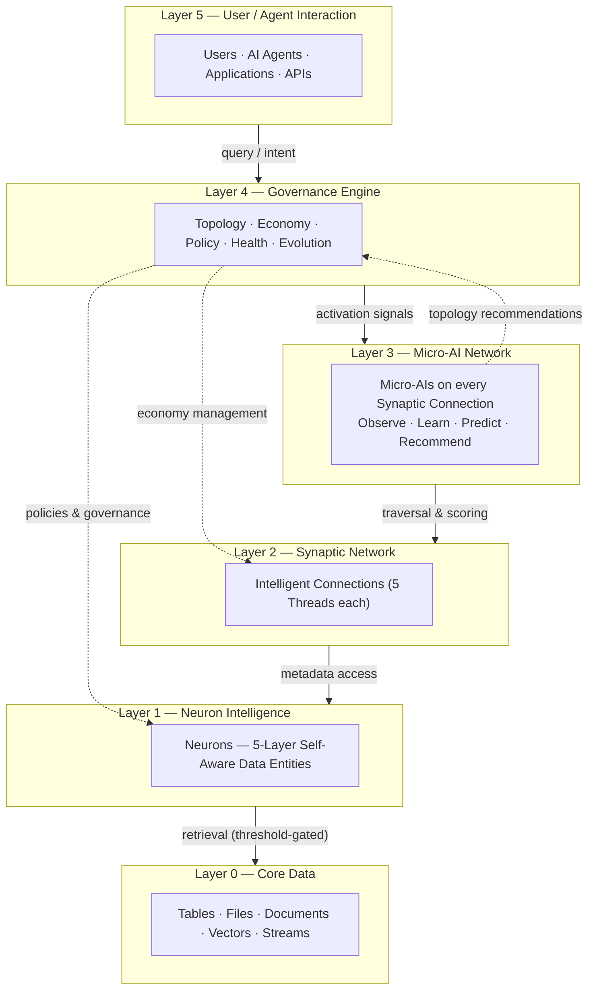

---

# 1. Architectural Principles

SIE is built on six foundational principles that together define why the platform behaves as a cognitive network rather than a traditional data system.

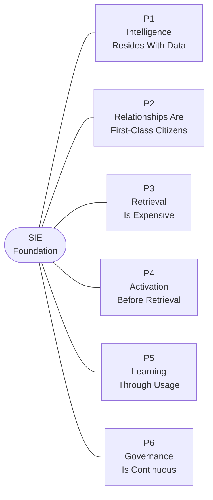

### Principle 1: Intelligence Resides With Data

Data entities carry their own metadata, context, governance, trust, and behavioral knowledge.

### Principle 2: Relationships Are First-Class Citizens

The intelligence of the platform emerges from relationships between entities rather than from isolated entities themselves.

### Principle 3: Retrieval Is Expensive

The platform must avoid unnecessary data retrieval and operate primarily on metadata, context, semantics, and connection intelligence whenever possible.

### Principle 4: Activation Before Retrieval

The system activates neurons and synapses based on context and intent before touching underlying data.

### Principle 5: Learning Through Usage

The platform continuously learns from usage telemetry and modifies its topology through Hebbian strengthening and weakening.

### Principle 6: Governance Is Continuous

Governance is embedded into every entity and connection rather than being enforced by external systems.

---

# 2. The SIE Cognitive Stack

The stack is read bottom-up: raw data at Layer 0 gains progressively more intelligence at each layer above it.

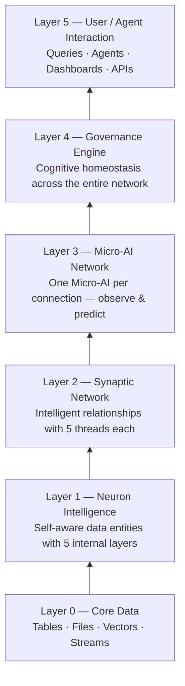

| Layer | Name | Role |
|-------|------|------|
| Layer 0 | Core Data | Raw facts |
| Layer 1 | Neuron Intelligence | Self-aware data entities |
| Layer 2 | Synaptic Network | Intelligent relationships |
| Layer 3 | Micro-AI Network | Learning & prediction |
| Layer 4 | Governance Engine | Health & evolution |
| Layer 5 | User / Agent Interaction | Consumption |

---

# 3. Neuron Specification

A Neuron is the atomic intelligence unit of SIE. Every business entity becomes a neuron — Customer, Order, Invoice, Claim, Provider, Product, Supplier.

Each neuron has **five layers** that wrap from the inside out. The outer layers allow the platform to reason about the entity without ever touching Layer 1.

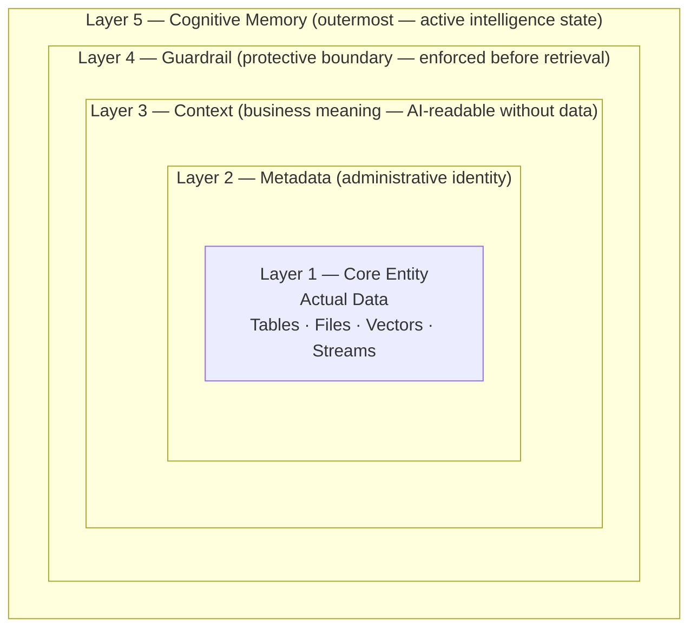

---

## Neuron Layer 1: Core Entity

The raw data. Flexi-structured, single source of truth. No Bronze/Silver/Gold medallion duplication.

| Type | Examples |
|------|----------|
| Structured | Tables, Views |
| Semi-structured | JSON, XML, Documents |
| Unstructured | Files, PDFs, Audio |
| AI-native | Vectors, Embeddings |
| Streaming | Event Streams |

---

## Neuron Layer 2: Metadata Layer

Administrative identity of the neuron — used for discovery, trust evaluation, and operational management. AI systems read this layer to know *who* the entity is.

**Contains:** Owner · Domain · Classification · Trust Score · Lineage · Sensitivity Labels · Version History · Data Quality Metrics · Last Modified Timestamp

---

## Neuron Layer 3: Context Layer

Business understanding of the neuron. AI systems read this layer to know *what* the entity means — without accessing data.

**Contains:** Business Definitions · Natural Language Description · Usage Patterns · Business Processes · Domain Knowledge · Semantic Embeddings · AI Behavioral Guidance

---

## Neuron Layer 4: Guardrail Layer

The protective enforcement boundary. Evaluated before any retrieval decision is made.

**Contains:** Access Policies · PII Rules · Compliance Policies · Data Sovereignty Rules · Retention Policies · Usage Restrictions · Export Rules

---

## Neuron Layer 5: Cognitive Memory Layer *(NEW)*

The neuron's active intelligence state. This is where the neuron "thinks." Micro-AIs operate primarily on this layer.

**Contains:** Activation Score · Intent Affinity Map · Recent Activations · Retrieval Cost Score · Confidence Levels · Behavioral History · Prediction Signals · Attention Weight · Associated Concepts

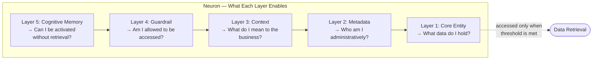

---

# 4. Synaptic Connection Specification

A Synaptic Connection is an intelligent relationship between two neurons. Connections are **first-class objects** — they carry their own intelligence and can be evaluated independently of the data they connect.

Each connection has **five threads**, each serving a distinct purpose.

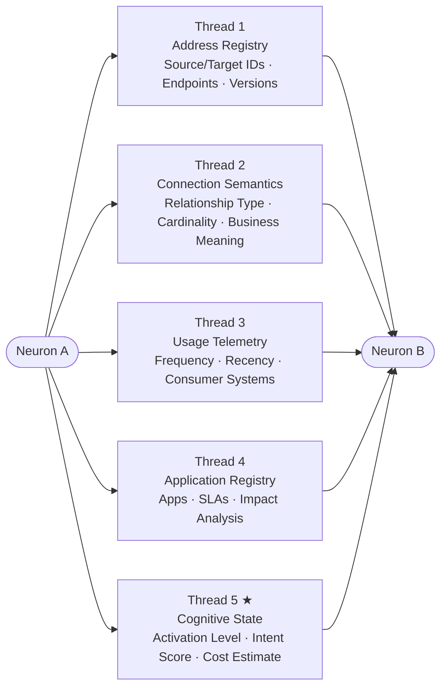

---

## Thread 1: Address Registry

Persistent physical navigation. Ensures the connection can be followed regardless of structural changes to either neuron.

**Contains:** Source Neuron ID · Target Neuron ID · Physical Endpoints · Version References · Location Metadata

---

## Thread 2: Connection Semantics

Describes *why* two neurons are related — the business meaning of the relationship.

**Contains:** Relationship Type · Join Attributes · Cardinality · Relationship Description · Confidence Score · Business Meaning

---

## Thread 3: Usage Telemetry

The learning signal. Every traversal writes here, powering the Hebbian model.

**Contains:** Access Frequency · Traversal Frequency · Recency Metrics · Consumer Systems · Consumer Agents · Usage Trends · Time-Based Access Patterns

---

## Thread 4: Application Registry

Blast-radius awareness. Answers "who would be affected if this connection changed?"

**Contains:** Applications · Agents · Consumers · Business Criticality · SLA Dependencies · Impact Analysis

---

## Thread 5: Cognitive State *(NEW)*

The connection's intelligence. Enables traversal decisions without touching data.

**Contains:** Current Activation Level · Intent Relevance Score · Predicted Future Use · Retrieval Cost Estimate · Connection Attention Score · Competing Connection Ranking · Confidence Score · Activation History

---

# 5. Micro-AI Specification

One Micro-AI instance lives on every Synaptic Connection. It reads threads 2–5 and writes back to Thread 5 (Cognitive State) and generates recommendations for the Governance Engine.

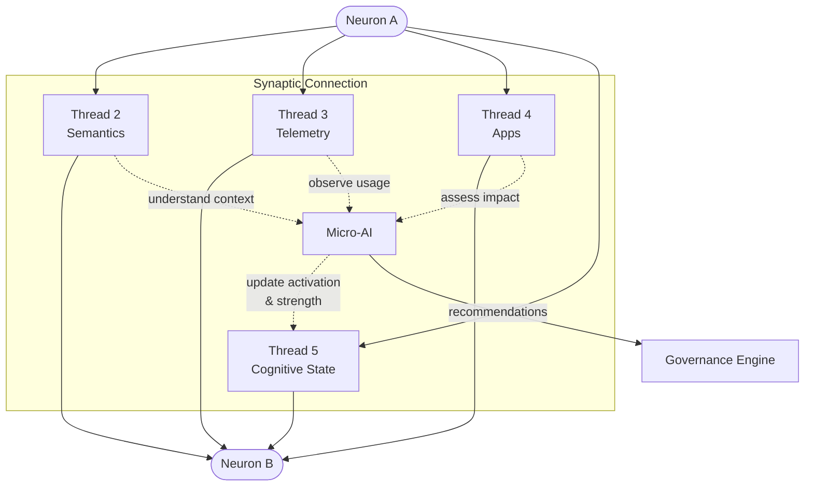

**Micro-AIs operate only on:** Metadata · Context · Guardrails · Telemetry · Cognitive State

**Micro-AIs are responsible for:** Observe · Learn · Predict · Recommend

**Micro-AIs never:** Execute data changes · Modify schemas · Override governance

**Micro-AI Outputs:** Connection Strength Updates · Context Updates · Trust Score Recommendations · Guardrail Alerts · Topology Recommendations

---

# 6. Synaptic Activation Protocol (SAP)

The SAP defines how SIE "thinks" — how a user query becomes a guided network traversal. The critical design choice is that **data retrieval is the last resort**, not the first step.

## SAP — Full Activation Flow

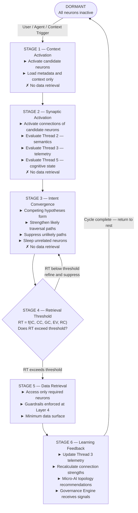

### Retrieval Threshold Components

| Signal | Symbol | Meaning |
|--------|--------|---------|
| Intent Confidence | IC | How certain is the system about user intent? |
| Context Confidence | CC | How well does context match neuron semantics? |
| Guardrail Confidence | GC | Is access permitted under current policies? |
| Expected Value | EV | How much value does retrieval add? |
| Retrieval Cost | RC | What is the compute / storage cost of retrieval? |

```
RT = f(IC, CC, GC, EV, RC)
```

Only if RT exceeds the configured threshold does retrieval begin.

---

## End-to-End Query Sequence

This sequence shows the same SAP stages from the perspective of each component.

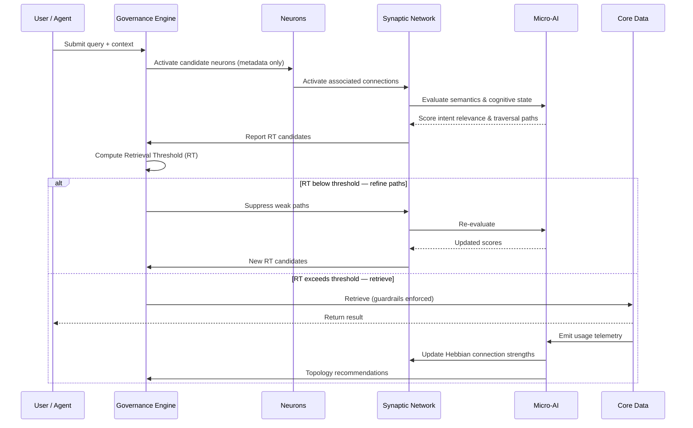

---

# 7. Hebbian Learning Model

> *"Neurons that fire together, wire together."*

Every traversal event updates the connection strength using four weighted signals. Strong connections activate faster, cost less, and rank higher in future queries. Weak connections decay toward dormancy.

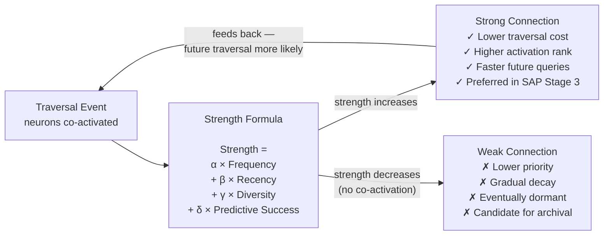

| Weight | Signal | Description |
|--------|--------|-------------|
| α | Frequency | How often are these neurons traversed together? |
| β | Recency | Was the last traversal recent? |
| γ | Diversity | Do many different consumers use this path? |
| δ | Predictive Success | Did following this path lead to correct outcomes? |

---

# 8. Governance Engine Specification

The Governance Engine is not a query processor. It is the **Cognitive Homeostasis System** of SIE — it maintains the health, compliance, and evolution of the entire cognitive network.

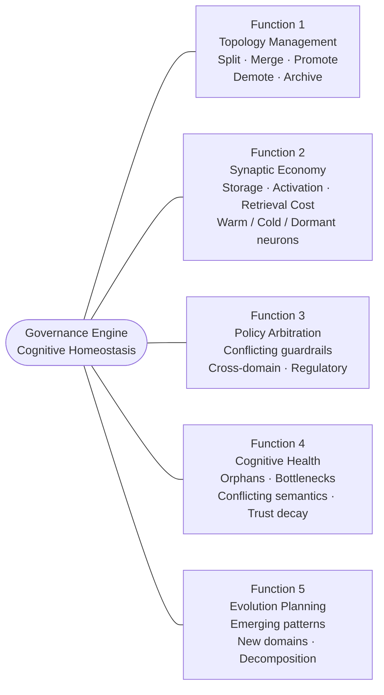

### Governance Function 1: Topology Management

Recommends structural changes to the neuron network: Split · Merge · Promote · Demote · Archive

### Governance Function 2: Synaptic Economy Management

Monitors and manages the cost of the network: Storage Cost · Activation Cost · Retrieval Cost · Compute Consumption

Manages warm (active), cold (infrequent), and dormant (inactive) neuron states.

### Governance Function 3: Policy Arbitration

Resolves conflicts: Conflicting guardrails · Cross-domain policies · Regulatory conflicts

Acts as final policy authority across all domains.

### Governance Function 4: Cognitive Health Monitoring

Detects network pathologies: Overloaded neurons · Orphan neurons · Conflicting semantics · Topology bottlenecks · Trust degradation

### Governance Function 5: Evolution Planning

Identifies emerging patterns and recommends: New domains · New entity structures · New relationships · Domain decomposition

---

# 9. Governance Hierarchy

Governance is distributed across three tiers. Local governors handle real-time activation decisions; domain governors handle domain-level policy; global governance enforces enterprise-wide standards.

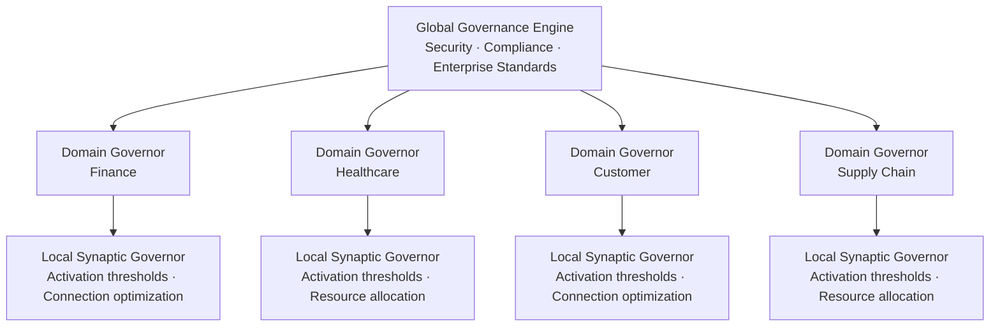

| Tier | Scope | Responsibilities |
|------|-------|-----------------|
| Global Governance Engine | Enterprise-wide | Security · Compliance · Standards |
| Domain Governance Engines | Per domain | Domain policies · Cross-entity rules |
| Local Synaptic Governors | Per connection cluster | Activation thresholds · Cost management |

---

# 10. End-State Vision

The final SIE architecture behaves as a **living cognitive network**. The contrast with traditional data platforms is fundamental — not a performance improvement but a paradigm shift.

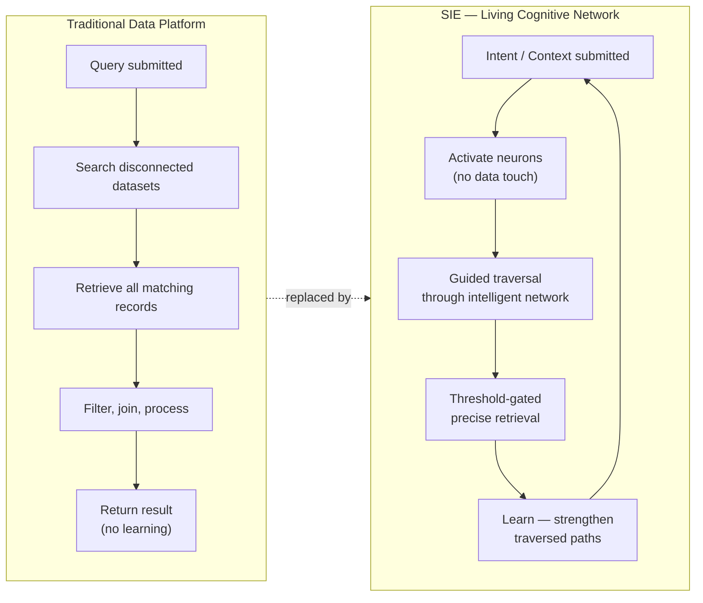

- **Neurons** maintain knowledge about themselves — identity, meaning, permissions, and memory — across their five layers.
- **Synapses** learn from usage — every traversal makes the next one smarter and cheaper.
- **Micro-AIs** observe and predict — making connection-level decisions without touching data.
- **Governance** maintains health and guides evolution — the network improves over time without manual intervention.

Queries become **guided traversals** through an intelligent network rather than brute-force searches across disconnected datasets.

The result is a **self-learning, self-governing, AI-native data platform** optimized for reasoning rather than reporting.
