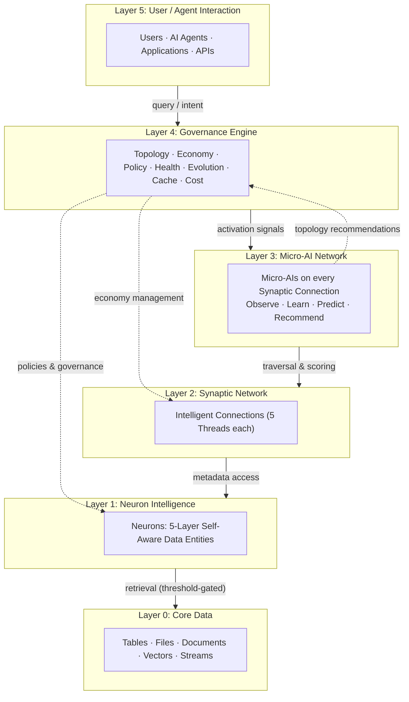
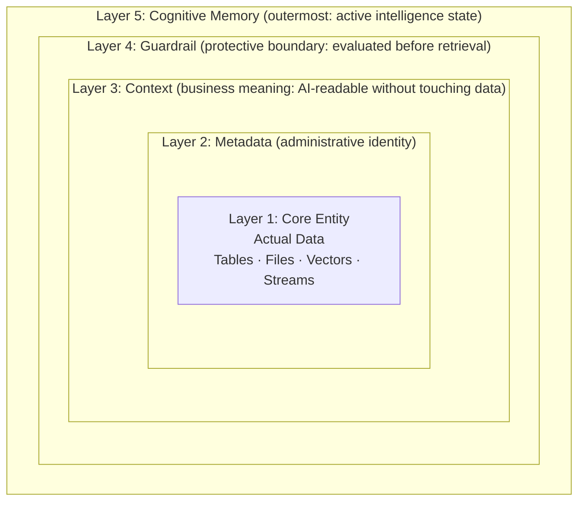
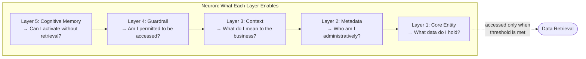
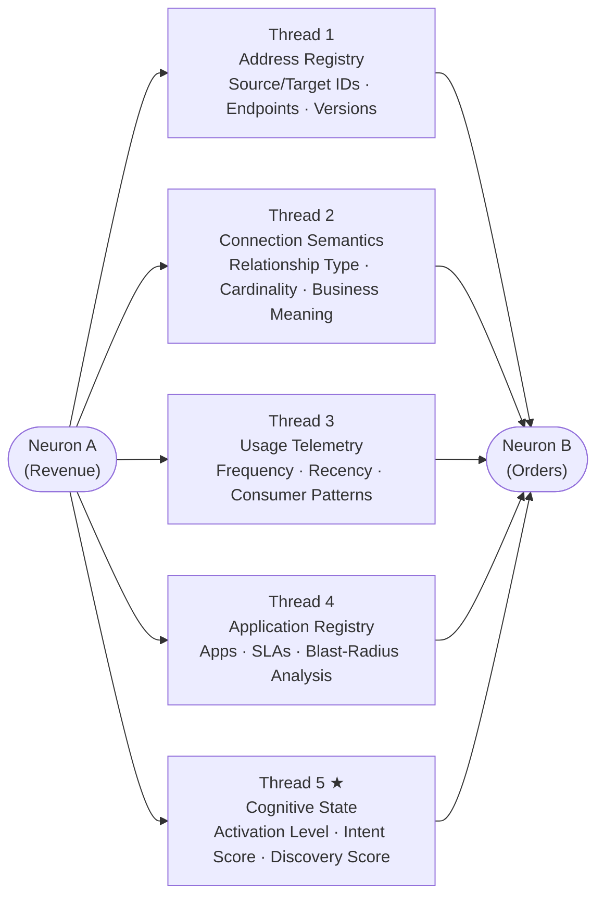
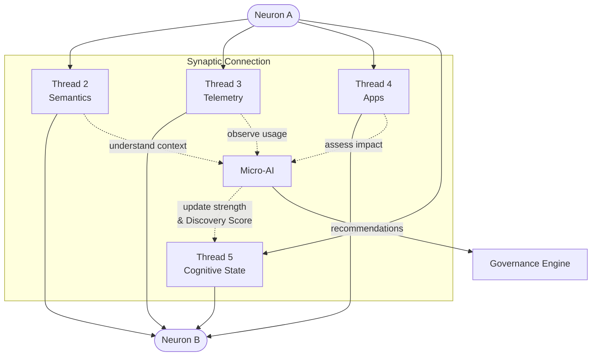
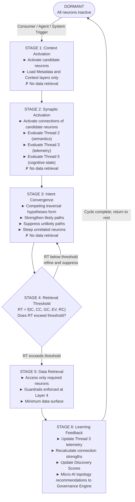
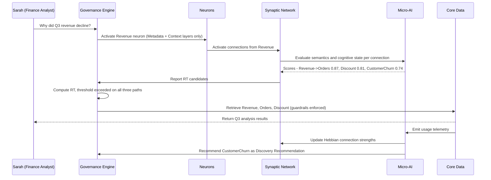
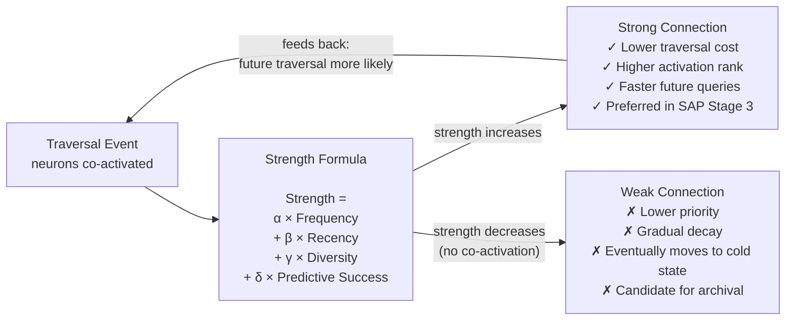
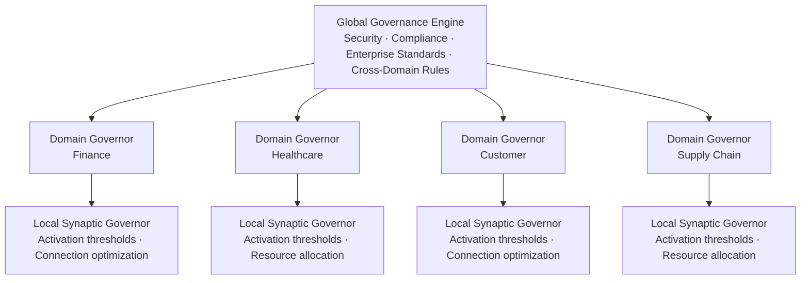
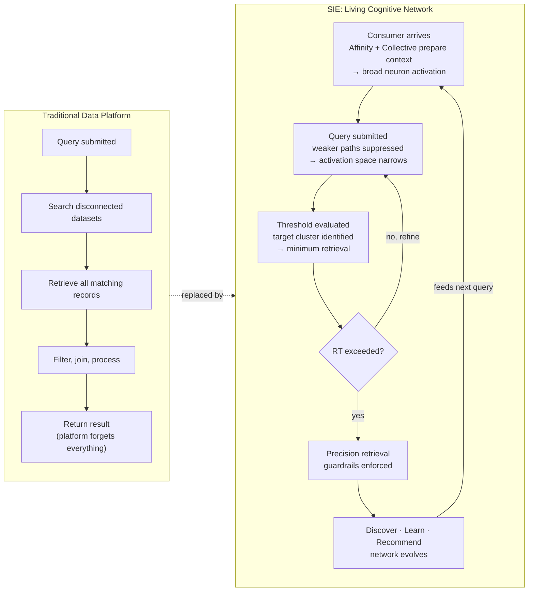

# Synaptic Intelligence Engine (SIE)

## Cognitive Model & Runtime Architecture
### Technical Specification – Version 2.0

---

## Purpose

This document defines the operational architecture of the Synaptic Intelligence Engine (SIE), extending the SIE Whitepaper into a concrete implementation model.

It describes how six categories of components (Neurons, Synaptic Connections, Micro-AIs, a Cognitive Cache, Intelligence Layers, and a Governance Engine) collaborate to form a self-organizing, self-learning, community-informed cognitive data platform.

The document follows a deliberate narrative arc:

1. **Principles and Overview:** the laws the platform never violates, and the map of how everything fits together
2. **The Data Model:** what neurons and synaptic connections are, and how they carry intelligence
3. **Intelligence Layers:** how the platform prepares, anticipates, and learns from every user before a query is submitted
4. **How SIE Thinks:** how a query flows through the network without touching data until the system is confident
5. **Scale and Governance:** how the platform grows horizontally and stays compliant
6. **The Complete Picture:** the full runtime flow and the end-state vision

---

## Running Example

Every concept in this document is illustrated through one consistent scenario.

> **Sarah** is a Finance Analyst at **Meridian Corp**. She opens her analytics interface and types:
> *"Why did Q3 revenue decline?"*

In a traditional medallion architecture, Sarah's query is fired against the Gold layer: a curated, pre-transformed copy of the data that has already passed through Bronze and Silver stages. She receives rows she must manually filter, join, and interpret. The platform retains nothing from the interaction once it ends.

In SIE, something fundamentally different happens. Before Sarah finishes typing, the platform has already prepared context based on who she is and what finance analysts like her typically investigate. By the time she submits her query, relevant neurons are warm, traversal paths are scored, and the system is close to a confident answer, without having read a single data record yet.

The entities involved in Sarah's investigation, each of which becomes a neuron in SIE:

| Business Entity | Neuron Name |
|----------------|-------------|
| Revenue KPI | `Revenue` |
| Orders fact table | `Orders` |
| Customer master record | `Customer` |
| Discount and pricing data | `Discount` |
| Product catalog | `Product` |
| Customer churn indicator | `Customer_Churn` |

This example threads through every section of this specification. By the end, you will have seen, in a single coherent story, how each component contributes to Sarah's experience and to the platform's continuous improvement.

---

# Part I: Principles and Overview

---

## 1. Architectural Principles

SIE is governed by six principles that function as hard constraints, not guidelines. Every design decision in this specification traces back to at least one of them.

| # | Principle | What It Means |
|---|-----------|---------------|
| P1 | **Intelligence Resides With Data** | Every entity carries its own metadata, context, governance, and behavioral history. The `Revenue` neuron knows what it is, who can access it, and how it has been used, with no external catalog or data dictionary needed. |
| P2 | **Relationships Are First-Class Citizens** | The platform's intelligence emerges from the connections between entities, not from isolated entities alone. The bond between `Revenue` and `Orders` is itself a first-class object with its own memory, strength score, and predictive capability. |
| P3 | **Retrieval Is Expensive** | SIE operates on metadata, semantics, and cognitive state for as long as possible. Fetching actual data records is the last resort, not the first instinct. |
| P4 | **Activation Before Retrieval** | Neurons and synapses activate on context and intent before any data is touched. The system thinks before it reads. |
| P5 | **Learning Through Usage** | Every interaction reshapes the network. When Sarah follows `Revenue → Customer_Churn`, that path strengthens, making the next analyst's journey faster and the recommendation more confident. |
| P6 | **Governance Is Continuous** | Policy is embedded in every neuron and every connection. There is no separate compliance gate bolted on after the fact; governance is part of the skeleton of the system. |

---

## 2. High-Level Architecture

SIE is structured as a live cognitive network, not a layered pipeline. It is conceptually closest to a knowledge graph where every node and every edge carries active, real-time intelligence. The diagram below shows how the six platform layers interact during any interaction.



Query intent flows downward through the layers. Learning signals flow upward, continuously reshaping connection strengths. Data retrieval (the access of raw records at Layer 0) is gated behind a confidence threshold and is never the default first action.

---

# Part II: The Data Model

*What SIE's entities are and how they carry intelligence.*

---

## 3. Neuron Specification

A Neuron is the atomic intelligence unit of SIE. Every business entity (every table, file, KPI, metric, or domain concept) becomes a neuron.

In Sarah's investigation, `Revenue`, `Orders`, `Customer`, `Discount`, `Product`, and `Customer_Churn` are all neurons. Each one knows itself: what it is, what it means, who can access it, how it has been used, and how likely it is to be relevant to the current moment.

Each neuron has **five concentric layers**, wrapping from the inside out. The outer layers allow SIE to reason about the entity without ever touching its raw data. Only when all outer layers are satisfied, and a confidence threshold is met, does the system access the innermost layer.



### Layer 1: Core Entity

The raw data itself. SIE stores it once, in its natural structure. There is no Bronze/Silver/Gold duplication, no medallion architecture.

| Type | Examples |
|------|----------|
| Structured | Tables, Views |
| Semi-structured | JSON, XML, Documents |
| Unstructured | Files, PDFs, Audio |
| AI-native | Vectors, Embeddings |
| Streaming | Event Streams |

*For `Revenue` at Meridian Corp: the underlying fact table containing transaction-level revenue records by region, product line, and date.*

### Layer 2: Metadata Layer

The administrative identity of the neuron. AI systems read this layer to know *who* the entity is: its ownership, quality, lineage, and classification.

**Contains:** Owner · Domain · Classification · Trust Score · Lineage · Sensitivity Labels · Version History · Data Quality Metrics · Last Modified Timestamp

*For `Revenue`: Owner = Finance Team, Domain = Finance, Classification = Confidential, Trust Score = 0.94, Last Modified = 2 hours ago.*

### Layer 3: Context Layer

The business understanding of the neuron. AI systems read this layer to know *what* the entity means, without accessing any data records.

**Contains:** Business Definitions · Natural Language Description · Usage Patterns · Business Processes · Domain Knowledge · Semantic Embeddings · AI Behavioral Guidance

*For `Revenue`: "Revenue is total recognized income from product sales, net of returns and allowances. It is a primary KPI for Finance leadership, typically analyzed alongside Orders, Margin, and Discount. Quarter-over-quarter comparisons are the most common access pattern."*

### Layer 4: Guardrail Layer

The protective enforcement boundary. This layer is evaluated before any retrieval decision is made. It is not checked afterwards.

**Contains:** Access Policies · PII Rules · Compliance Policies · Data Sovereignty Rules · Retention Policies · Usage Restrictions · Export Rules

*For `Revenue`: Accessible to Finance roles only. No PII content. Export restricted to internal BI tools. Regulatory flag: SOX-relevant data, audit logging required.*

### Layer 5: Cognitive Memory Layer

The neuron's active intelligence state: where it "thinks." Micro-AIs operate primarily on this layer and update it after every interaction.

**Contains:** Activation Score · Intent Affinity Map · Recent Activations · Retrieval Cost Score · Confidence Levels · Behavioral History · Prediction Signals · Attention Weight · Associated Concepts

*For `Revenue`: Activation Score = 0.87 (one of the most frequently activated neurons in the Finance domain). Intent Affinity Map shows strong association with `Orders`, `Margin`, and `Discount`. Prediction Signal: high probability of co-activation with `Customer_Churn` when the consumer is a Finance Analyst asking about decline.*

The five layers answer a precise sequence of questions during any activation:



The platform reads layers 5 through 2 without touching Layer 1. Retrieval only begins when the Retrieval Threshold (defined in Section 9) is exceeded.

---

## 4. Synaptic Connection Specification

A Synaptic Connection is an intelligent relationship between two neurons. It is not a foreign key. It is not a join condition. It is a **first-class object** that carries its own intelligence, has its own memory, and can be evaluated independently of the data it connects.

In Sarah's investigation, the connection between `Revenue` and `Orders` is a knowledge object with a history. So is the connection between `Revenue` and `Customer_Churn`, even though Sarah has never explicitly followed that path. The platform knows that other Finance Analysts have, and it has learned from them.

Each connection has **five threads**, each serving a distinct purpose:



### Thread 1: Address Registry

Persistent physical navigation. Ensures the connection can be followed regardless of structural changes to either neuron.

**Contains:** Source Neuron ID · Target Neuron ID · Physical Endpoints · Version References · Location Metadata

### Thread 2: Connection Semantics

Describes *why* two neurons are related: the business meaning of the relationship, not just its technical join key.

**Contains:** Relationship Type · Join Attributes · Cardinality · Relationship Description · Confidence Score · Business Meaning

*For `Revenue → Orders`: "Revenue is derived from aggregated Order amounts. One-to-many relationship on `order_date` and `region`. Business meaning: Orders is the transactional source of Revenue; changes in Order volume directly drive Revenue changes."*

### Thread 3: Usage Telemetry

The learning signal. Every traversal writes here, powering the Hebbian model described in Section 10.

**Contains:** Access Frequency · Traversal Frequency · Recency Metrics · Consumer Systems · Consumer Agents · Usage Trends · Time-Based Access Patterns

*For `Revenue → Orders`: Traversed 847 times in the last 90 days. Primary consumers: Finance Analysts (62%), CFO Executive Dashboard (31%), Revenue AI Agent (7%). Last traversal: 2 hours ago.*

### Thread 4: Application Registry

Blast-radius awareness. Answers the question: "Who would be affected if this connection were changed or removed?"

**Contains:** Applications · Agents · Consumers · Business Criticality · SLA Dependencies · Impact Analysis

*For `Revenue → Orders`: Modifying this connection affects 14 downstream reports, 3 executive dashboards, and 2 AI agents. Business criticality = Critical. Any structural change triggers a mandatory impact review.*

### Thread 5: Cognitive State

The connection's live intelligence. This is what enables traversal decisions to be made without touching any data.

**Contains:** Current Activation Level · Intent Relevance Score · Predicted Future Use · Retrieval Cost Estimate · Connection Attention Score · Competing Connection Ranking · Confidence Score · Activation History · **Discovery Score**

The **Discovery Score** is a distinct metric that measures how often traversing this connection leads to a *valuable follow-on insight*, not just how frequently it is used.

*For `Revenue → Customer_Churn`: Traversal frequency is moderate (38 times in 90 days), but Discovery Score = 0.91. Nearly every Finance Analyst who followed this connection found a meaningful downstream insight and took action on it. The Micro-AI on this connection maintains a high Discovery Score and actively recommends it, even though it is not the most-traveled path.*

---

## 5. Micro-AI Specification

One Micro-AI instance lives on every Synaptic Connection. It is not a separate service or process. It is an abstracted intelligence layer embedded in the connection itself, always observing, always updating.

The Micro-AI reads threads 2, 3, 4, and 5. After each traversal, it writes an updated Cognitive State back to Thread 5. It also sends topology and scoring recommendations to the Governance Engine.



**Micro-AIs operate only on:** Metadata · Context · Guardrails · Telemetry · Cognitive State

**Micro-AIs are responsible for:** Observe · Learn · Predict · Recommend

**Micro-AIs never:** Execute data changes · Modify schemas · Override governance decisions

**Micro-AI Outputs:** Connection Strength Updates · Discovery Score Updates · Trust Score Recommendations · Guardrail Alerts · Topology Recommendations

*In Sarah's scenario: The Micro-AI on `Revenue → Customer_Churn` observes that this connection is traversed infrequently but consistently yields high-value downstream analysis. It maintains a high Discovery Score and recommends the path to the Governance Engine for promotion in Finance Analyst queries, even though Sarah has never personally followed it.*

---

# Part III: Intelligence Layers

*How SIE prepares, anticipates, and learns from every user, before a query is submitted.*

---

## 6. Cognitive Cache Layer

The Cognitive Cache Layer manages where neurons live in memory at any moment. This determines how quickly the platform can activate them when a query arrives. Without an effective cache, every query would start cold, and activation latency would scale poorly with the size of the network.

SIE uses a three-zone model:

| Zone | State | Description |
|------|-------|-------------|
| **Cold** | Dormant | Metadata only. Minimal resource consumption. The neuron exists in the registry but holds no active state. |
| **Warm** | Active without data | Activation state is maintained. The neuron is ready to participate in reasoning but has not loaded its underlying data. |
| **Hot** | Retrieval-eligible | Currently active. Guardrails evaluated. One threshold decision away from returning data. Fastest response path. |

The Governance Engine manages zone transitions based on usage signals from Thread 3 telemetry. A neuron traversed frequently gets promoted. One that goes unused for a configured period gets demoted, releasing its allocated compute and memory resources.

**Activation Bundles** extend the cache concept to entire traversal paths. When SIE observes that a sequence of neurons is always activated together (such as `Revenue → Orders → Customer`), it packages that sequence into a reusable bundle. Subsequent queries that match this pattern skip the activation recalculation entirely and replay the bundle directly.

**Synaptic Cache** does the same for reasoning. When a traversal path produces the same intent mapping repeatedly, SIE caches the result: the inferred intent, the path confidence scores, and the recommended next steps. Reasoning becomes a fast lookup rather than a repeated computation.

*In Sarah's scenario: When she logs in, `Revenue`, `Orders`, and `Discount` are already in warm state, because the Affinity Intelligence Layer (Section 7) prepared them. `Customer_Churn` is in cold state; Sarah has never explicitly asked about it. The activation bundle for `Revenue → Orders → Discount` is pre-loaded. By the time Sarah types her question, much of the activation work is already done.*

---

## 7. Affinity Intelligence Layer

The Cognitive Cache manages *where* neurons live. The Affinity Intelligence Layer determines *which* neurons to warm up before a consumer even arrives.

This layer models each consumer (human analyst, application, AI agent, or department) through a continuously updated Persona Profile.

**Persona Profile contains:**
- Interests and preferred domains
- Frequently traversed paths
- Recent activities and open investigations
- Historical interactions and outcomes
- Intent tendencies (the types of questions this consumer typically asks)

When a consumer opens a session, SIE reads their Persona Profile and predicts which neurons and synaptic connections are most likely to be relevant. It begins warming them immediately.

This is **Predictive Activation**: neurons transition from cold to warm based on *who arrived*, not on *what they asked*.

The next step is **Cognitive Prefetching**: SIE pre-activates full activation bundles (entire neuron clusters and their scored synaptic paths) so that when the query arrives, the bulk of the reasoning is already complete. This mirrors the way a skilled human analyst mentally prepares context before a meeting begins.

*In Sarah's scenario: The moment Sarah logs in, SIE reads her Finance Analyst profile. It knows she typically investigates Revenue, Margin, and Discount Rate, and that her last three sessions all started with a Revenue question. It warms `Revenue`, `Orders`, and `Discount`. It pre-loads the `Revenue → Orders → Discount` activation bundle. By the time Sarah types "Why did Q3 revenue decline?", the platform was already halfway there. Sarah experiences a response that feels immediate. She does not know the system has been preparing for 30 seconds while she reviewed her email.*

---

## 8. Collective Intelligence Layer

The Affinity Intelligence Layer learns from Sarah's own history. The Collective Intelligence Layer learns from everyone.

SIE aggregates intelligence across three tiers:

| Tier | Source | What It Captures |
|---|---|---|
| **Personal Intelligence** | This consumer's own history | Past queries, traversals, and interests: what Sarah specifically has done and found useful |
| **Community Intelligence** | Peer group patterns | What Finance Analysts as a group typically investigate after asking about revenue decline; this represents the accumulated experience of Sarah's professional peers |
| **Global Intelligence** | Platform-wide patterns | KPIs that are frequently connected across all users, cross-domain relationships that consistently yield insight, common investigation paths that transcend any single team |

This matters because individual users cannot know what they do not know. A new Finance Analyst at Meridian Corp does not know that experienced colleagues consistently connect Revenue investigations to Customer Churn analysis. The Collective Intelligence Layer does. It makes that knowledge available before the analyst knows to ask for it.

*In Sarah's scenario: When her session begins, SIE has already consulted all three tiers:*

- *Personal: Sarah investigated `Revenue → Orders → Discount` last quarter. That path is well-known to her.*
- *Community: Finance Analysts who asked about Q-o-Q revenue decline examined `Customer_Churn` 72% of the time in the past 12 months.*
- *Global: The `Revenue → Customer_Churn` connection has been identified across the entire platform as a high-insight, cross-domain relationship.*

*All three tiers shape which neurons enter warm state, which paths score higher during intent convergence, and which recommendations surface after retrieval. Sarah benefits from the institutional knowledge of every analyst who came before her, without reading a single one of their reports.*

---

# Part IV: How SIE Thinks

*The cognitive protocol that transforms a query into a guided traversal.*

---

## 9. Synaptic Activation Protocol (SAP)

The SAP is the core runtime protocol: the definition of how SIE processes a query. It has six stages. The critical design decision is that **data retrieval is the last resort**, not the first step. The first four stages run entirely on metadata, context, and cognitive state. No data record is touched until Stage 5, and Stage 5 only begins when the system has passed a confidence threshold.



### Stage-by-Stage: Sarah's Query

**Stage 1: Context Activation**

Sarah's query arrives: *"Why did Q3 revenue decline?"* The Governance Engine identifies `Revenue` as the primary candidate neuron. It activates `Revenue` using only its Metadata (Layer 2) and Context (Layer 3) layers. No transaction records are read. Because the Affinity Layer has already warmed this neuron, activation is near-instant.

**Stage 2: Synaptic Activation**

The connections from `Revenue` are activated. The Micro-AIs on each connection evaluate Thread 2 (what does this connection mean semantically?) and Thread 5 (how confident are we that this path is relevant to this query?). Three connections score above the activation threshold: `Revenue → Orders`, `Revenue → Discount`, and `Revenue → Customer_Churn`. Two others (`Revenue → Product` and `Revenue → Customer`) score below it and remain dormant.

**Stage 3: Intent Convergence**

Three competing hypotheses form simultaneously. Is Sarah investigating a volume problem (`Revenue → Orders`)? A pricing problem (`Revenue → Discount`)? A retention problem (`Revenue → Customer_Churn`)? The system does not know yet. It strengthens all three paths proportionally to their scores while suppressing the lower-probability paths. Unrelated neurons are put to sleep. The activation space narrows. No data has been retrieved.

**Stage 4: Retrieval Threshold Evaluation**

The system calculates the Retrieval Threshold for each remaining path:

```
RT = f(IC, CC, GC, EV, RC)
```

| Signal | Symbol | Meaning | Value for Sarah's Query |
|--------|--------|---------|------------------------|
| Intent Confidence | IC | How certain is the system about user intent? | 0.82 (the query is specific and clear) |
| Context Confidence | CC | How well does context match neuron semantics? | 0.91 (Finance Analyst + Revenue is a strong match) |
| Guardrail Confidence | GC | Is access permitted under current policies? | 1.0 (Sarah has confirmed Finance role access) |
| Expected Value | EV | How much value does retrieval add given what is already known? | 0.88 (retrieval likely produces actionable insight) |
| Retrieval Cost | RC | What is the compute and storage cost of retrieval? | 0.3 (Revenue is hot; cost is low) |

The combined RT exceeds the configured threshold. The system proceeds to Stage 5.

**Stage 5: Data Retrieval**

Only the neurons that passed the threshold are accessed: `Revenue`, `Orders`, and `Discount`. Layer 4 guardrails are enforced at the retrieval boundary; Sarah's Finance role is verified one final time. SIE retrieves the minimum data surface required: Q3 aggregates by region and product line, not the full transactional history.

**Stage 6: Learning Feedback**

Thread 3 telemetry is updated on all three active connections. The Micro-AIs recalculate strength scores using the Hebbian formula. The `Revenue → Customer_Churn` connection, which Sarah did not follow, is noted: its Discovery Score remains high, and the Micro-AI recommends it to the Governance Engine for surfacing as a post-retrieval recommendation.

### End-to-End Sequence



---

## 10. Hebbian Learning Model

> *"Neurons that fire together, wire together."*

Every traversal event updates the strength of the connections involved. This is the mechanism by which SIE gets smarter with use: the tenth analyst to ask about Revenue decline benefits from the accumulated experience of the nine who came before.

Connection strength is recalculated after each traversal using four weighted signals:



| Weight | Signal | Description |
|--------|--------|-------------|
| α | Frequency | How often are these neurons traversed together across all consumers? |
| β | Recency | Was the last traversal recent, or has this path gone quiet? |
| γ | Diversity | Do many different types of consumers use this path, or just one team? |
| δ | Predictive Success | Did following this path lead to correct, useful, acted-upon outcomes? |

The Strength Score and the Discovery Score serve different purposes and are maintained independently:

- **Strength Score** captures how *often* a path is used. A heavily-traveled path gets a high Strength Score even if it rarely leads to new insight.
- **Discovery Score** captures how often a path leads to *valuable downstream analysis*. A less-traveled path with consistently high-impact outcomes gets a high Discovery Score.

*In Sarah's scenario: After her session, `Revenue → Orders` and `Revenue → Discount` receive Strength Score increases. `Revenue → Customer_Churn` does not. Sarah did not traverse it. However, its Discovery Score remains 0.91 because the 38 other Finance Analysts who did traverse it consistently found actionable insight. The platform distinguishes popularity from value.*

---

## 11. Discovery Intelligence

Not every high-value path is frequently traveled. Some connections are infrequent but consistently lead to genuine insights when they are followed. Discovery Intelligence captures this distinction and acts on it.

The **Discovery Score** on each Synaptic Connection (Thread 5) measures how often traversal of that connection produces a valuable follow-on analysis downstream. It is calculated from the outcomes of past traversals: did analysts who followed this path find something they acted on?

Consider the contrast within Sarah's scenario:

| Connection | Traversal Frequency | Discovery Score | Interpretation |
|---|---|---|---|
| `Revenue → Orders` | 847 times / 90 days | 0.67 | Heavily used; frequently confirms what is already known |
| `Revenue → Discount` | 412 times / 90 days | 0.71 | Common path; often leads to pricing investigations |
| `Revenue → Customer_Churn` | 38 times / 90 days | 0.91 | Rarely followed; nearly always reveals something unexpected and acted on |

SIE uses Discovery Scores to generate **Discovery Recommendations**: proactive suggestions surfaced after retrieval, pointing users toward insight paths they did not know to ask for.

After returning Sarah's Q3 Revenue analysis, SIE presents:

> *"Finance Analysts investigating Revenue decline typically also examine Customer Churn. This connection has a high Discovery Score. Would you like to explore it?"*
>
> *"Finance leaders investigating Margin often examine Discount Rate. Discount data is already warm in this session and can be retrieved at low cost."*

These are not generic suggestions. They are grounded in the actual traversal history of every Finance Analyst who used SIE before Sarah, filtered by their role, their domain, and the type of question they were asking.

---

## 12. Cognitive Experience Layer

Every interaction contributes to the platform's accumulated experience. The Cognitive Experience Layer is where that experience lives: persisted, indexed, and served to improve every future interaction.

**Contains:**
- **Personal Experience:** Sarah's specific traversal history, preferences, and feedback
- **Community Experience:** Finance Analyst group patterns, aggregated and anonymized
- **Global Experience:** platform-wide insight patterns, cross-domain relationships
- **Discovery Intelligence:** Discovery Scores across all connections, continuously updated
- **Recommendation Confidence:** a track record of how reliable each recommendation type has been
- **User Feedback History:** the explicit signals users have provided about recommendation quality

This layer is read at the start of every session by the Affinity Intelligence Layer (to prepare the right neurons) and the Collective Intelligence Layer (to load community and global patterns). It is written at the end of every session, updated with what was learned, what was traversed, and what feedback was received.

---

## 13. User Feedback Learning Loop

SIE's recommendations improve through use. The platform does not rely on human curators or manual tuning cycles. It learns directly from how its users respond.

| Signal | Effect |
|---|---|
| **Positive** (user follows recommendation; rates it useful; takes action on the insight) | Increase recommendation confidence · Increase Discovery Score on the connection · Strengthen affinity profile relationship |
| **Negative** (user ignores recommendation; rates it unhelpful; marks it as irrelevant) | Decrease recommendation confidence · Reduce relevance score · Suppress this recommendation type for similar future queries |

*In Sarah's scenario: After receiving the Q3 analysis, Sarah sees the Discovery Recommendation to investigate `Customer_Churn`. She follows it. She finds that customer churn in the Southeast region increased sharply in Q3, directly explaining the Revenue decline. She marks the recommendation as "very useful" and takes action on the finding.*

*The effect on the platform: The Discovery Score on `Revenue → Customer_Churn` increases from 0.91 to 0.93. The recommendation confidence for this path in Finance Analyst sessions increases. The next Finance Analyst who asks about Revenue decline at Meridian Corp receives this recommendation with even higher prominence and confidence, benefiting from Sarah's experience without knowing it.*

---

# Part V: Scale and Governance

*How SIE handles enterprise scale while remaining coherent and compliant.*

---

## 14. Cognitive Domain Sharding

As SIE grows to cover an entire enterprise, a scalability model is necessary. Traditional platforms shard by region, date range, or customer segment, which are technical partitions with no semantic meaning. SIE shards by **cognitive domain**.

Each domain shard is a self-contained intelligence mesh: its own neurons, its own synaptic network, its own local governance, and its own activation models. Domain shards keep the activation search space small. When Sarah asks about Revenue, the Governance Engine routes her query to the Finance Domain shard. It does not search Healthcare, Retail, or Supply Chain.

| Domain Shard | What It Contains |
|---|---|
| **Finance Domain** | Revenue, Orders, Margin, Discount, Customer Churn (Sarah's world) |
| **Healthcare Domain** | Clinical entities, claims, providers, procedures, outcomes |
| **Retail Domain** | Products, inventory, campaigns, customer journeys, promotions |
| **Supply Chain Domain** | Logistics, suppliers, lead times, capacity, procurement |

Cross-domain connections do exist and are valuable. Global Intelligence (Section 8) discovers and maintains them. However, they are traversed deliberately, not searched by default. The Finance Domain shard can reference the Supply Chain shard when a Discount investigation reveals a supplier cost driver, but this traversal is an explicit recommendation, not a default search.

**Purpose:** Reduce activation search space, increase horizontal scalability, prevent cross-domain noise from degrading relevance.

---

## 15. Governance Engine

The Governance Engine is not a query processor. It is the **Cognitive Homeostasis System** of SIE: the component responsible for keeping the network healthy, compliant, efficient, and structurally sound as it grows and evolves over time.

**Function 1: Topology Management**
Recommends and executes structural changes as usage patterns evolve. Splits overloaded neurons when a single entity grows too large to reason about efficiently. Merges redundant ones that duplicate meaning. Promotes frequently accessed nodes to warmer cache states, demotes inactive ones, and archives entities that have become obsolete.

**Function 2: Synaptic Economy Management**
Monitors the cost profile of the entire network across storage, activation, and retrieval dimensions. Classifies neurons into hot, warm, and cold states and allocates compute resources accordingly. Ensures that the most-used paths are the cheapest to traverse.

**Function 3: Policy Arbitration**
Acts as the final authority when guardrail conflicts arise: cross-domain access rules, competing regulatory requirements, or sensitivity label disagreements between domains. Resolves conflicts without requiring manual intervention by a human administrator.

**Function 4: Cognitive Health Monitoring**
Continuously scans the network for pathologies: overloaded neurons, orphaned entities with no connections, conflicting semantic definitions across domains, topology bottlenecks, and decaying trust scores. Raises alerts and generates remediation recommendations.

**Function 5: Evolution Planning**
Identifies emerging usage patterns that signal the need for structural change before bottlenecks become critical. Recommends new domain shards, new entity structures, new relationship types, or decomposition of domains that have grown too large.

**Function 6: Cache Lifecycle Management**
Manages hot/warm/cold activation state transitions across the entire neuron network. Controls cache promotion and demotion based on Thread 3 telemetry, ensuring frequently activated neurons remain in appropriate states while dormant entities release their resources back to the pool.

**Function 7: Cognitive Resource Optimization**
Monitors cognitive resource utilization across the network. Balances the prediction accuracy of the Affinity and Collective Intelligence layers against their compute consumption. Ensures the platform remains efficient at enterprise scale even under heavy prefetching.

**Function 8: Activation Cost Management**
Tracks and optimizes the cost of activation decisions made by the Affinity Intelligence Layer and Collective Intelligence Layer. Ensures predictive pre-activation does not overconsume resources. Maintains network health across all activation zones.

---

## 16. Governance Hierarchy

Governance is distributed across three tiers. Each tier has a distinct scope and a distinct set of responsibilities. Local governors handle real-time activation decisions; domain governors manage domain-level policy; the global engine enforces enterprise-wide standards and cross-domain rules.



| Tier | Scope | Responsibilities |
|------|-------|-----------------|
| Global Governance Engine | Enterprise-wide | Security, compliance, enterprise data standards, cross-domain policy arbitration |
| Domain Governance Engines | Per domain | Domain-specific policies, cross-entity rules within the domain, shard-level health |
| Local Synaptic Governors | Per connection cluster | Real-time activation thresholds, connection cost management, cache state enforcement |

*In Sarah's scenario: The Local Synaptic Governor for the Finance Domain evaluated the guardrail on `Revenue` at SAP Stage 4, before retrieval began. It confirmed that Sarah's Finance Analyst role satisfies the access policy without escalating to the Domain or Global tier. The Global Governance Engine was not involved because no cross-domain access or regulatory conflict arose. This tiered design ensures that the most common cases are resolved locally and cheaply, while edge cases escalate to the appropriate authority.*

---

# Part VI: The Complete Picture

---

## 17. Complete Runtime Flow

The following is the full cognitive execution path for every SIE interaction, combining all components described in this document. Each step in the flow maps to at least one section above.

```
Consumer Arrives
↓
Affinity Intelligence Layer       [§7]  Persona loaded; neurons identified; relevant warm-up begins
↓
Collective Intelligence Layer     [§8]  Personal + community + global patterns consulted
↓
Predictive Activation             [§6]  Warm/hot neurons and activation bundles pre-loaded
↓
Neuron Activation    [SAP Stage 1] [§9]  Metadata + Context layers only; no data
↓
Synaptic Activation  [SAP Stage 2] [§9]  Threads 2, 3, 5 evaluated; paths scored
↓
Intent Convergence   [SAP Stage 3] [§9]  Competing paths ranked; unlikely paths suppressed
↓
Retrieval Threshold  [SAP Stage 4] [§9]  RT = f(IC, CC, GC, EV, RC); gate decision made
↓
Data Retrieval       [SAP Stage 5] [§9]  Guardrails enforced; minimum data surface
↓
Discovery Recommendations         [§11] High Discovery Score connections surfaced as next steps
↓
Feedback Collection               [§13] Explicit and implicit signals captured
↓
Learning + Topology Evolution     [§10,12,13] Hebbian updates · Discovery Score updates · Governance signals
```

**Sarah's complete journey in one pass:**

1. Sarah logs in. Her Finance Analyst Persona Profile loads.
2. Affinity Intelligence warms `Revenue`, `Orders`, and `Discount`. The `Revenue → Orders → Discount` bundle is pre-loaded.
3. Collective Intelligence notes: 72% of Finance Analyst revenue-decline queries lead to `Customer_Churn` examination.
4. Sarah types: *"Why did Q3 revenue decline?"*
5. SAP Stages 1-3 run on metadata and cognitive state. No data is retrieved.
6. SAP Stage 4: RT threshold exceeded. Stage 5 proceeds.
7. Revenue, Orders, and Discount data is retrieved, with minimum surface and guardrails enforced.
8. Results are returned. SIE surfaces: *"Finance Analysts investigating Revenue decline typically examine Customer Churn (Discovery Score: 0.91). Would you like to explore this connection?"*
9. Sarah follows the recommendation. She finds that customer churn in the Southeast region explains the Q3 decline.
10. She marks the recommendation as "very useful."
11. Discovery Score for `Revenue → Customer_Churn` increases to 0.93. The next Finance Analyst benefits.

---

## 18. End-State Vision

SIE replaces brute-force search with network cognition. The contrast with traditional data platforms is not incremental. It is a shift in what a data platform fundamentally is.



What changes with SIE:

- **Neurons** maintain knowledge about themselves across five layers (identity, meaning, permissions, and memory), with no external catalog needed.
- **Synapses** learn from every traversal. The tenth analyst to investigate Revenue decline gets a faster, more targeted, and more insightful response than the first.
- **Micro-AIs** observe and predict at the connection level, making traversal decisions without touching data.
- **The Cognitive Cache** keeps frequently needed entities warm and ready, converting costly activation into cheap recall.
- **Affinity Intelligence** anticipates what each consumer needs before they ask; the platform prepares while the user thinks.
- **Collective Intelligence** gives every individual the benefit of institutional knowledge, surfacing what peer groups and the full platform have learned.
- **Discovery Intelligence** guides users toward insights they did not know to look for, the connections that matter most, not just the ones traveled most.
- **Governance** maintains health and guides evolution automatically, without manual intervention.

The platform evolves from a self-aware data architecture to a **self-learning, self-optimizing, community-informed cognitive intelligence network**.

It does not merely answer questions. It anticipates intent, guides exploration, learns from every interaction, and continuously improves the experience of every future user who arrives, including the next Sarah, who will never know how much the platform learned from the one who came before her.
